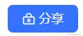
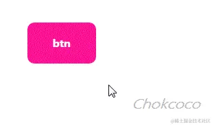
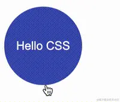
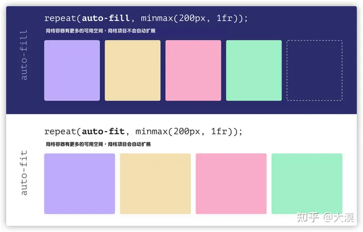
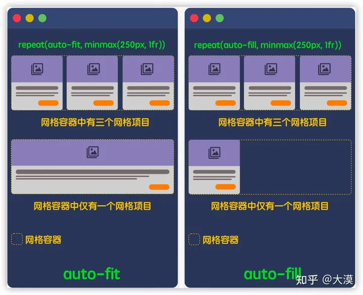
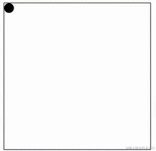

# 基础 css 属性

## 权重

```txt
内联:1000
id:100
class,属性，伪类:10
标签，伪元素：1
* ： 0
```

## 替换元素

如果只有替换元素的 vertical-align 是没有 baseline 的，没有基线概念

如果还有文字的话，文字的基准是 baseline 替换元素是直接 bottom,所以底部会有空白出现

## 伪元素(Pseudo-elements)

### before / after
> 伪元素是用来选择某一元素的子元素，并在这些子元素上添加额外的样式。  
> 伪元素在 HTML 代码中并不存在，可以通过 CSS 代码来为其添加样式

:::tip
after 或者 before 是默认是 **_inline 模式_**，同时必须要有 content, 需要设置为 `inline-block` 才可以设置宽高
:::

### 例子
#### 使用一个元素无法完成完整样式的绘制，需要额外的元素
```html
<style>
  .pop {
      position: relative;
      width: 200px;
      height: 100px;
      background: #e91e63;
      border-radius: 8px; 
  }

  .pop::after {
      content:"";
      position: absolute;
      top: 45px;
      left: -24px;
      width: 0;
      height: 0;
      border: 12px solid;
      border-color: transparent #e91e63 transparent transparent;
  }
</style>

<div class="pop"/>
```

<style scoped module="after">
  .pop {
      position: relative;
      width: 200px;
      height: 100px;
      background: #e91e63;
      border-radius: 8px; 
  }

  .pop::after {
      content:"";
      position: absolute;
      top: 45px;
      left: -24px;
      width: 0;
      height: 0;
      border: 12px solid;
      border-color: transparent #e91e63 transparent transparent;
  }
</style>

<div :class="after.pop"/>

-----

#### 当元素无具体语义时，与宿主又属于同一主体进行展示



```html
<style>
  div {
      position: relative;
      width: 100px;
      height: 48px;
      background: blue;
      border-radius: 10px;
  }

  div::before {
      content: "";
      position: absolute;
      background-image: url(icon.png)
  }
</style>
<div>分享</div>
```
----

#### 增强元素的交互体验，又不想额外添加元素
```css
.btn::before{
  content:"";
  position:absolute;
  top:-10px;
  right:-10px;
  bottom:-10px;
  left:-10px;
}
```



### 伪元素的 content

::: tip
  ::before 和 ::after 伪元素想要生效，一定要有content元素，至少需要设置 content: ' '。
:::

```html
<style>
div::before {
  content: attr(data-content);
}
</style>  
<div data-content="EDF">ABC</div>
```
<style scoped module="before">
.div::before {
  background:yellow;
  height:40px;
  border-radius:20px;
  content: attr(data-content);
}
</style>  
<div data-content="EDF" :class="before.div">黄色部分是伪元素</div>

----

#### content 的动画

```html
<style scoped module="before1">
  .p {
      position: relative;
  }

  .p::after {
      content: "";
      position: absolute;
      top: 0;
      bottom: 0;
      animation: dot 3s infinite steps(3, start);
  }

@keyframes dot {
    33.33% {
        content: ".";
    }
    66.67% {
        content: "..";
    }
    100% {
        content: "...";
    }
}
</style>  

<p :class="before1.p">加载中</p>
```

<style scoped module="before1">
  .p {
      position: relative;
  }

.p::after {
    content: "";
    position: absolute;
    top: 0;
    bottom: 0;
    animation: dot 3s infinite steps(3, start);
}

@keyframes dot {
    33.33% {
        content: ".";
    }
    66.67% {
        content: "..";
    }
    100% {
        content: "...";
    }
}
</style>  

<p :class="before1.p">加载中</p>

----

#### 没有伪元素的元素
` 、 <input>、 <iframe>` 不能包含其他元素，所以不能通过伪元素插入内容  

但是 `img` 失效后可以使用伪元素

```html
<style>
img.error {
    position: relative;
    display: inline-block;
}

img.error::before {
    content: "";
    background: url( error-default.png ); 
} 

img.error::after {  
    content: attr(alt)
}; 

</style>  

```


## 伪类(Pseudo-classes)
> 伪类则是用于选取当前元素的某个状态或属性，并且这个状态不能通过普通选择器选择到。  
> 例如 `:hover`、`:link`、`:visited`、`:active` 等。  
> 伪类可以选择不同状态的内容，比如链接不同状态下的颜色等。  
> 伪类也可以应用于元素之外，例如 :first-child 可以选择某个元素的第一个子元素。
### 伪元素与伪类的区别
- 伪元素是用来表示选中某一元素内部的子元素，并在这些子元素上添加样式；***而伪类是用来表示元素的状态，并在元素处于该状态时添加样式***。
- 伪元素能够创建一些不存在于文档结构中的元素，而伪类只是改变已经存在的元素的表现形式。
- 伪元素通常使用 :: 两个冒号, 伪类单个冒号进行表示
 
## 选择器
### :not
```css
/* class a 但是不含有 b */
.a:not(.b)  
 /* 悬浮过去 但是不含有 isNotCurrentMonth 标签 */
.cellData:hover:not(.isNotCurrentMonth) // 
```

```html
<!--黄色-->
<div class="css-a"></div>
<!--紫色-->
<div class="css-a css-b"></div>

<style>
  .css-a {
    width: 100px;
    height: 100px;
    background-color: rebeccapurple;
    &:not(.css-b) {
      background-color: yellow;
    }
  }
</style>
```

实际效果

<!--黄色-->
<div class="css-a"></div>
<!--紫色-->
<div class="css-a css-b"></div>

<style lang="scss" scoped>
  .css-a {
    width: 100px;
    height: 100px;
    background-color: rebeccapurple;
    &:not(.css-b){
      background-color: yellow;
    }
  }
</style>

```html
<div class="cellData"></div>
<div class="cellData isNotCurrentMonth"></div>

<style lang="scss" scoped>
  .cellData {
    width: 100px;
    height: 100px;
    background: yellow;
    &:hover:not(.isNotCurrentMonth) {
      background-color: rebeccapurple;
    }
  }
</style>
```

<div class="cellData"></div>
<div class="cellData isNotCurrentMonth"></div>

<style  lang="scss" scoped>
  .cellData {
    width: 100px;
    height: 100px;
    background:yellow;
    &:hover:not(.isNotCurrentMonth){
      background-color: rebeccapurple;
    }
  }
</style>

---

### first-child

<div>
  <div :class="child.a">a</div>
  <div :class="child.a">a</div>
  <div :class="child.a">a</div>
</div>

<style module="child">
.a:first-child{
  color:red
}
</style>

## 选择位置

### 前面是

```html
<div class="icon">icon</div>
<span>span</span>

<style>
  /* 选择span */
  .icon + span {
    color: red;
  }
</style>
```

<div :class="chooseFront.icon">icon</div>
<span>span</span>

<style module="chooseFront">
  /* 	 选择span */
  .icon + span {
    color: red;
  }
</style>

### 后面是

```html
<div class="icon">icon</div>
<span>span</span>

<style>
  /* 选择span */
  .icon:has(+span) {
    color: orange;
  }
</style>
```

<div :class="back.icon">icon</div>
<span>span</span>

<style module="back">
  /* 	 选择span */
   .icon:has(+span) {
    color: orange;
  }
</style>

### 里面有

```html
<div class="icon">icon <span>aaa</span> </div>

<style>
  /* 选择icon */
	/* 这个是只要是子元素就可以 */
  .icon:has(span){
    color: yellow;
  }
 /* 必须是直接子元素 */
  .icon:has(>span){
    color: yellow;
  }
</style>
```

### 不为空

```html
<div class="icon">icon <span>aaa</span> </div>

<style>
  /* 选择icon */
.icon:not(:empty){
  color: red;
}
</style>
```

## 属性
### order 改变元素位置

```html
<ul>
  <li style="--bg:red" >1</li>
  <li style="--bg:green"> 2</li>
  <li style="--bg:yellow">3</li>
</ul>

<style>
  ul{
    display: flex;
  }

  li{
    margin: 10px;
    color: var(--bg);
  }
  /*  本应该在 最后面*/
  li:nth-child(2){
    order: -1;  /*[!code ++] */
  }
</style>
```

<ul :class="order.orderUl">
  <li :class="order.orderLi" style="--bg:red" >1</li>
  <li style="--bg:green"> 2</li>
  <li style="--bg:orange">3</li>
</ul>

<style scoped lang="scss" module="order">
  
  .orderUl{
    display: flex;
  }

  .orderLi{
    margin: 10px;
    color: var(--bg);
  }

  .orderLi:nth-child(2){
    order: -1;
  }
</style>

### transition
#### transition 基础讲解
 transition: transform 1s linear 0s
- transition-property：过渡属性，指定应用过渡属性的名称；
- transition-duration：过渡持续时间，指定过渡动画持续的时间；
- transition-timing-function：过渡缓动，指定过渡动画过程中的缓动函数；
- transition-delay：过渡延迟，指定过渡动画延迟多久才被触发。
#### 支持多个属性的精细化控制
```css
{
    // 可以这样
    transition: all 1s linear;

    // 也可以这样
    transition: 
        height 1s linear, 
        transform 0.5s,
        color 2s ease-in-out 0.5s;
}
```
:::info
如果没有延迟时间，最后一个 0s 可以省去。  
同理，过渡的缓动函数默认是 ease，如果希望缓动是 ease，则 ease 关键字也可以省略（ease：规定过渡先缓慢地开始，然后加速，然后缓慢地结束）
:::
#### 巧用多层元素，解决交互闪烁问题
```html
<style>
  .g-circle {
   /* ... */
    transition: transform .3s;
  }
  .g-circle:hover {
      transform: translate(0, -20px);
  }
</style>  
<div class="g-circle">Hello CSS</div>
```

<style scoped module="circle">
  .circle {
    width:100px;
    height:100px;
    border-radius:50%;
    background:#3a49af;
    color:white;
    display:flex;
    align-items:center;
    justify-content:center;
    transition: transform .3s;
  }
  .circle:hover {
    transform: translate(0, -20px);
  }
</style>  
<div :class="circle.circle">Hello CSS</div>
在最底部hover可能会发生抖动

----



这是由于元素的初始态和 hover 状态下的终态，元素的位置发生了变化，中间存在 20px 高度差，当鼠标从下方 hover 上去的时候，触发了元素向上位移的过渡动画，元素在向上位移的过程中，鼠标很有可能会失去元素的焦点，导致元素失去 hover 状态，此时元素就会回归本位，在回归的过程中鼠标又能重新获得元素的焦点……如此反复，就导致了整个元素的抖动！

```html
<style>

.g-circle {
    transition: transform .3s;
}

.g-container:hover .g-circle {
    transform: translate(0, -20px);
}

</style>  
<div class="g-container">
    <div class="g-circle">Hello CSS</div>
</div>
```

<style scoped module="circle">
  .circle {
    width:100px;
    height:100px;
    border-radius:50%;
    background:#3a49af;
    color:white;
    display:flex;
    align-items:center;
    justify-content:center;
    transition: transform .3s;
  }

  .container:hover .circle {
    transform: translate(0, -20px);
  }
</style>  
<div :class="circle.container">
    <div :class="circle.circle">Hello CSS</div>
</div>
我们是通过触发父元素的 hover 控制子元素的样式变化，父元素本身的位置是不会发生变化的。

### flex 与 inline-flex

他们的表现形式有点类似于 **_`block`_** 和 **_`inline-block`_**。  

- 设置为 flex 容器，**它的宽度和父容器等宽**，即 width 为 100%，也称块 Flexbox 容器 

- 设置为 inline-flex 容器，它的**宽度是由其子元素（后代元素）的内容来决定**，相当于 width 为 auto，也称内联 Flexbox 容器

:::tip
`display: flex;` 相当于 `display: block flex;`

`display: inline-flex;` 相当于 `display: inline flex;`
:::

```html
<style>
  .app {
    width: 100px;
    height: 100px;
    background-color: green;
  }
</style>

<body>
  <div class="app">
    <span style="display: flex;height: 100%;background-color: red;"></span>  <!-- //[!code focus] -->
  </div>

  <div class="app">
    <span style="display: inline-flex;height: 100%;background-color: yellow;">  <!-- //[!code focus] -->
     abcd
    </span>
  </div>
</body>
```

重点关注他们的宽度,flex 的宽度和父容器一致,inline-flex的宽度和子容器的宽度一致

<style module="flex" scoped lang="scss">
  
  .app {
    width: 100px;
    height: 100px;
    background-color: green;
  }
</style>
  
  <div :class="flex.app">
    <span style="display: flex;height: 100%;background-color: red;"></span>
  </div>

  <div :class="flex.app">
    <span style="display: inline-flex;height: 100%;background-color: yellow;"> 
     abcd
    </span>
  </div>

----
#### flex:1 与 width 的权重

flex:1 的权重比 width 权重更高

```html
<style>
  .app {
    width: 100px;
    height: 100px;
    background-color: green;
  }

  .flex-item {
    flex: 1;  /*[!code ++] */
    width: 200px; /*[!code --] */
    background-color: aqua;
  }
</style>

<body>
  <div class="app">
    <div style="display: flex;
      flex-wrap: wrap;
      width: 500px;
      height: 100%;
      background-color: red;">
      <div class="flex-item"></div>
      <div class="flex-item"></div>
      <div class="flex-item"></div>
      <div class="flex-item"></div>
      <div class="flex-item"></div>
      <div class="flex-item"></div>
      <div class="flex-item"></div>
      <div class="flex-item"></div>
    </div>
  </div>
</body>
```

可以打开 `f12` 切换 `flex:1` 与 `width`,目前是 `flex:1` 在生效

<style scoped lang="scss" module="flex">
  .flexItem {
      flex: 1;
      width: 200px;
      background-color: aqua;
    }
  .app {
      width: 100px;
      height: 100px;
      background-color: green;
  };
</style>

  <div :class="flex.app">
    <div style="
      display: flex;
      flex-wrap: wrap;
      width: 500px;
      height: 100%;
      background-color: red;">
      <div :class="flex.flexItem"></div>
      <div :class="flex.flexItem"></div>
      <div :class="flex.flexItem"></div>
      <div :class="flex.flexItem"></div>
      <div :class="flex.flexItem"></div>
      <div :class="flex.flexItem"></div>
      <div :class="flex.flexItem"></div>
      <div :class="flex.flexItem"></div>
    </div>
  </div>

### grid 与 inline-grid

- grid 创建的网格容器是块盒，**网格容器的宽度和父容器宽度相等**
- inline-grid 创建的网格容器是内联盒子，**网格容器的宽度将由其具有最大宽度（max-content）的子元素（网格项目）来决定**

```css
.block-container {
    display: grid;
    /*相当于*/
    display: block grid;
}

.inline-container {
    display: inline-grid;
    /* 相当于 */
    display: inline grid;
}
```

```html
<body>
    <div
    style="display: inline-grid;
    width: 200px;
    height: 500px;
    background-color: red;">
      <div>首页</div>
      <div>逛逛</div>
      <div>购物车</div>
      <div>222222222222222</div>
    </div>
</body>
```

如果是 `display:inline-grid` 宽度是子元素的最大宽度

  <div style="display: inline-grid;
    height: 500px;
    background-color: red;">
      <div>首页</div>
      <div>逛逛</div>
      <div>购物车</div>
      <div>222222222222222</div>
  </div>

如果是 `display:grid` 宽度是父级宽度

  <div style="display: grid;
    height: 500px;
    background-color: red;">
      <div>首页</div>
      <div>逛逛</div>
      <div>购物车</div>
      <div>222222222222222</div>
  </div>

----

#### 网格

默认情况下,网格项目是 Stretch（拉伸的）

#### 轨道尺寸

- 带有不同单位的长度值，如 px、em、rem、%、vw 等，还有网格布局中独有的单位 fr
- 关键词，比如 none、auto、min-content 和 max-content
- CSS 函数，比如 fit-content()、minmax()、repeat()、min()、max()和 clamp()等

:::info 
为了让你的 CSS Grid 更为灵活（适应性更强），在定义网格轨道的时候，应该尽可能的使用内在尺寸，即 ***使用关键词和 CSS 的函数*** 
::: 

PC 端常见的两列布局，即 则边栏固定宽度，主内容区域自适应。


如果使用 CSS Grid 来布局的话，通常会像下面这样：

```css
  .container {
    display: grid;
    gap: 1rem;
    grid-template-columns: 250px 1fr;
    grid-template-areas: "sidebar "main";
}
```

可以设置的更为灵活

```css
  .container {
    grid-template-columns: fit-content(250px) 1fr;
}
```

`fit-content(250px) = fit-content(200px) = min(min(max-content, 网格中的可用宽度), max(min-content, 200px))`   

这样的好处是根据**可用空间自动匹配**,最大不超过 `250px`,最小不小于 `max-content`

:::tip 
在 CSS Grid 布局中，定义网格轨道尺寸时，***尽可能的不要使用外在尺寸***（比如设置固定的长度值\<length>），应该尽可能的使用内在尺寸（比如 min-content）

即使不使用内在尺寸，也应尽可能的结合 CSS 的函数（比如 min()、max()和 clamp()等），来提高网格轨道尺寸的灵活性和自适应性！
:::

#### 🚀auto-fill 与 auto-fit

- auto-fit 将扩展网格项目以填补可用空间，  
-  auto-fill 不会扩展网格项目。相反，auto-fill 将**保留可用的空间，而不改变网格项目的宽度**



在网格容器中有多个和仅有一个网格项目时，使用 auto-fill 与 auto-fit 的差异：



-----

### overscroll-behavior
#### 锁定滚动链 overscroll-behavior
最常见的情景是你打开一个弹框（Modal）并向下滚动到底部（垂直方向）时，如果继续向下滚动则会引起弹框下方的内容（通常是 body 元素）会继续滚动。这也是滚动链默认的表现行为：

```html
   <div style="
      overflow-y: auto;
      height: 200px;
      background-color: red;">
    <!-- 控制浏览器过度滚动时的表现——也就是滚动到边界。 -->
  <div 
      style="height: 300px;
      background-color:antiquewhite;
      overscroll-behavior-y: contain; /*//[!code focus] */
      overflow-y: scroll;">
      <div 
        style="height: 500px;
        background-color: aqua;">
      </div>
    </div>
  </div>
```
  <div style="
      overflow-y: auto;
      height: 200px;
      background-color: red;">
    <!-- 控制浏览器过度滚动时的表现——也就是滚动到边界。 -->
  <div 
      style="height: 300px;
      background-color:antiquewhite;
      overscroll-behavior-y: contain;
      overflow-y: scroll;">
      <div 
        style="height: 500px;
        background-color: aqua;">
      </div>
    </div>
  </div>

---
  #### [scroll-behavior](https://developer.mozilla.org/zh-CN/docs/Web/CSS/scroll-behavior)
1. scroll-behavior
   实现平稳的滚动 
2. scroll-snap-type
    如果它当前没有被滚动，这个滚动容器的可视视图将静止在临时点上。意思是当滚动动作结束，如果可能，它会临时在那个点上。
3. [scroll-snap-align(滚动捕捉对齐)](https://developer.mozilla.org/en-US/docs/Web/CSS/scroll-snap-align)   
  - start
  - end
  - center
 当前元素的哪个位置与父元素对齐 
  ```html
    <style>
    .behavior-contain {
      width: 100vw;
      min-height: 100vh;
      display: flex;
      flex-direction: column;
      align-items: center;
      background-color: #f7f7f7;
    }

    .behavior-section {
      background: url("https://www.w3cplus.com/sites/default/files/blogs/2021/2104/apple-iphone12-blue-portrait.png") no-repeat center;
      background-size: contain;
      width: 320px;
      height: 568px;
      position: relative;
    }

    .behavior-container {
      display: flex;
      width: 230px;
      height: 500px;
      position: absolute;
      top: 50%;
      transform: translate(0, -50%);
      left: 45px;
      border-radius: 30px;

      overflow-x: auto;
      overflow-y: hidden;
      scroll-behavior: smooth; /*[!code ++] */
      scroll-snap-type: x mandatory; /*[!code ++] */
    }

    .img {
      width: auto;
      height: 500px;
      object-fit: cover;
      object-position: center;
      scroll-snap-align: center; /*[!code ++] */
      scroll-snap-stop: always; /*[!code ++] */
    }
  </style>
</head>

<div :class="behavior.behavior-contain">
  <section class="behavior-section">
    <div class="behavior-container">
      
      
      
      
      
      
      
      
      
      
      
      
      
      
      
      
    </div>
  </section>
</div>
</body>
```
<style lang="scss" scoped module="behavior">
    .behaviorContain {
      display: flex;
      flex-direction: column;
      align-items: center;
      background-color: #f7f7f7;
    }

    .section {
      background: url("https://www.w3cplus.com/sites/default/files/blogs/2021/2104/apple-iphone12-blue-portrait.png") no-repeat center;
      background-size: contain;
      width: 320px;
      height: 568px;
      position: relative;
    }

    .container {
      display: flex;
      width: 230px;
      height: 500px;
      position: absolute;
      top: 50%;
      transform: translate(0, -50%);
      left: 45px;
      border-radius: 30px;
      overflow-x: auto;
      overflow-y: hidden;
      scroll-behavior: smooth;
      scroll-snap-type: x mandatory;
    }

    .img {
      width: auto;
      height: 500px;
      object-fit: cover;
      object-position: center;
      scroll-snap-align: center;
      scroll-snap-stop: always;
    }
  </style>

<div :class="behavior.behaviorContain">
  <section :class="behavior.section">
    <div :class="behavior.container">
      
      
      
      
      
      
      
      
      
      
      
      
      
      
      
      
    </div>
  </section>
</div>

### inset

inset: 0 就等同于 top:0; left: 0; right: 0; bottom: 0   

也可以  inset: 2px 4px 6px 8px; /* 上 | 右 | 下 | 左 */

左右间距 :`inset-inline:5% 10%`  
上下间距 :`inset-block:5% 10%`  

### mask

> mask 译为遮罩。在 CSS 中，mask 属性允许使用者通过遮罩或者裁切特定区域的图片的方式来隐藏一个元素的部分或者全部可见区域


```html
<style lang="scss" scoped module="basicMask">
    .mask{
      margin: auto;
      width: 500px;
      height: 250px;
      background: url("../../assets/img/maskYaSuo.webp") no-repeat;
      background-size: cover;
      mask: linear-gradient(90deg, transparent, #000);
    }
</style>  

<div :class="basicMask.mask"></div>
```

<style lang="scss" scoped module="basicMask">
  .mask{
    margin: auto;
    width: 500px;
    height: 250px;
    background: url("../../assets/img/maskYaSuo.webp") no-repeat;
    background-size: cover;
    mask: linear-gradient(90deg, transparent, #000);
  }
</style>  

<div :class="basicMask.mask"></div>

**相当于带一个`口罩`,`口罩`可以是透明的,也可以是不透明,就是裁切样式**
#### 使用 mask 实现内切圆角图形
```css:line-numbers{4-21}
.circle {
  width:200px;
  height:120px;
  background: linear-gradient(45deg, #2179f5, #e91e63);
  mask: radial-gradient( 
          circle at 100% 100%,
          transparent 0,
          transparent 12px,#2179f5 13px
      ),radial-gradient(
          circle at 0 0,
          transparent 0,
          transparent 12px,#2179f5 13px
      ),radial-gradient(
          circle at 100% 0,
          transparent 0,
          transparent 12px,#2179f5 13px
      ),radial-gradient(
          circle at 0 100%,
          transparent 0,
          transparent 12px,#2179f5 13px
      );
  mask-repeat: no-repeat;
  mask-position: right bottom, left top, right top, left bottom;
  mask-size: 70% 70%;
}
```
<style scoped module="mask">
.circle {
  width:200px;
  height:120px;
  background: linear-gradient(45deg, #2179f5, #e91e63);
  mask: radial-gradient(
          circle at 100% 100%,
          transparent 0,
          transparent 12px,#2179f5 13px
      ),radial-gradient(
          circle at 0 0,
          transparent 0,
          transparent 12px,#2179f5 13px
      ),radial-gradient(
          circle at 100% 0,
          transparent 0,
          transparent 12px,#2179f5 13px
      ),radial-gradient(
          circle at 0 100%,
          transparent 0,
          transparent 12px,#2179f5 13px
      );
  mask-repeat: no-repeat;
  mask-position: right bottom, left top, right top, left bottom;
  mask-size: 70% 70%;
}
 </style> 

<div :class="mask.circle">inset-circle</div>


#### mask 实现渐变消失布局

<style lang="scss" module="mask" scoped>
  .ul {
    width: 300px;
    margin: auto;
    display: flex;
    flex-wrap: nowrap;
    overflow-x: scroll;
    mask: linear-gradient(90deg, #000 70%, transparent);
    padding: 5px;
    
    button {
        margin-right: 12px;
        border-radius: 5px;
        border: 1px solid #666;
        padding: 4px;
        cursor: pointer;
        
        &:hover {
            background: #666;
            color: #fff;
        }
    }
}
</style> 

<div :class="mask.ul">
    <button>Button</button>
    <button>Button</button>
    <button>Button</button>
    <button>Button</button>
    <button>Button</button>
    <button>Button</button>
</div>

**Mask 的核心就是遮罩，遮挡住元素的内容（可以是部分挡住，可以是逐渐消失，甚至是可以分块挡住），显示出其元素背后的内容,如果是透明,可以显示后面内容**

## 自定义属性

```html
<style>
  ul {
    display: flex;
    justify-content: space-between;
  }

  li {
    width: 50px;
    height: 50px;
    border-radius: 50%;
    background-color: var(--bgColor, #000);
  }

  li:nth-child(1) {
    --bgColor: #f00;
  }

  li:nth-child(3) {
    --bgColor: #fc0;
  }

  li:nth-child(5) {
    --bgColor: #690;
  }
</style> 

<ul>
    <li></li>
    <li></li>
    <li></li>
    <li></li>
    <li></li>
</ul>
```
<style type="scss" scoped module="propertyUl">
  .ul {
      display: flex;
      justify-content: space-between;
      list-style:none
    }
    
    .li {
      width: 50px;
      height: 50px;
      border-radius: 50%;
      background-color: var(--bgColor, #000);
     }

      .li:nth-child(1) {
        --bgColor: #f00;
      }

      .li:nth-child(3) {
        --bgColor: #fc0;
      }

      .li:nth-child(5) {
        --bgColor: #690;
      }

</style> 

<ul :class="propertyUl.ul">
    <li :class="propertyUl.li"></li>
    <li :class="propertyUl.li"></li>
    <li :class="propertyUl.li"></li>
    <li :class="propertyUl.li"></li>
    <li :class="propertyUl.li"></li>
</ul>

第 2、4 个，使用了 var(--bgColor, #000) 中的黑色作为默认兜底值

### CSS 自定义属性的传值方式
```html
<style>
#g-element {
    width: 100px;
    height: 100px;
    background: var(--bgColor);
}
</style>
<div id="g-element"></div>
```
1. 通过 CSS 代码进行 CSS 变量值的传递。
```css
:root {
    --bgColor: #000;
}

/* 或者 */
#g-element {
    --bgColor: #000;
    width: 100px;
    height: 100px;
    background: var(--bgColor);
}
```
2. 通过元素的 style 属性进行 CSS 变量值的传递
  ```html
    <div id="g-element" style="--bgColor: #000"></div>
  ```
3. 通过 JavaScript 改写 style 属性进行 CSS 变量值的传递。
   ```js
    const bgColor = '#000';
    document.querySelector('#g-element')
    .setAttribute('style', `--bgColor: ${bgColor}`);
   ```  
## @property 属性
### 语法
```css
  @property --property-name {
    syntax: '<color>';
    inherits: false; /* 是否允许继承 */
    initial-value: #fff; /* 初始值 */
  }

  div {
    color: var(--property-name);
  }
```
### 支持的 syntax 语法类型
- length
- number
- percentage
- length-percentage
- color
- \<color#>: 接受逗号分隔的颜色值列表
- \<length+>: 接受以空格分隔的长度值列表
- \<length | length+>: 接受单个长度或者以空格分隔的长度值列表

```css
  /**
    - width: 100% -- 其中 100% 对应 percentage。
    - height: 95px -- 其中 95px 对应 length。
    - color: #fff -- 其中 #fff 对应 color。
    - border-radius: 10% 20% 30% 40% -- 其中 10% 20% 30% 40% 对应的是 percentage，但是这里是多个百分比取值，所以可以利用 + 号规则，表示为 percentage+，接受以空格分隔的百分比值列表
  */

  div{
      width: 100%;
      height: 95px;
      color: #fff;
      border-radius: 10% 20% 30% 40%;
      background-image: url(image.png);
      transition-duration: 1s;
  }
```
### @Property 的优势
```css
  :root {
      --colorA: #fff;
      --colorB: #000;
  }

  div {
      width:100px;
      height:100px;
      background-image: linear-gradient(45deg, var(--colorA), var(--colorB));
      transition: 1s background-image;
      &:hover {
          --colorA: yellowgreen;
          --colorB: deeppink;
      }
  }
```

<style scoped lang="scss" module="gradient">
  .gradient {
    --colorA: #fff;
    --colorB: #000;
    width:100px;
    height:100px;
    background-image: linear-gradient(45deg, var(--colorA), var(--colorB));
    transition: 1s background-image;
      
    &:hover {
      --colorA: yellowgreen;
      --colorB: deeppink;
    }
  }
</style> 

<div :class="gradient.gradient" />

background-image 是没有动画效果的, 使用 @Property 进行改造

```css:line-numbers{15-22}
  @property --houdini-colorA {
    syntax: '<color>';
    inherits: false;
    initial-value: #fff;
  }
  @property --houdini-colorB {
    syntax: '<color>';
    inherits: false;
    initial-value: #000;
  }

  .property { 
      width:100px;
      height:100px;
      background-image: linear-gradient(45deg, var(--houdini-colorA), var(--houdini-colorB));
      transition: 
        1s --houdini-colorA, 
        1s --houdini-colorB; 
      
      &:hover {
          --houdini-colorA: yellowgreen;
          --houdini-colorB: deeppink;
      }
  }
```

<style scoped lang="scss" module="gradient2">
  @property --houdini-colorA {
    syntax: '<color>';
    inherits: false;
    initial-value: #fff;
  }

  @property --houdini-colorB {
    syntax: '<color>';
    inherits: false;
    initial-value: #000;
  }

  .property {
      width:100px;
      height:100px;
      background-image: linear-gradient(45deg, var(--houdini-colorA), var(--houdini-colorB));   
      transition: 
        1s --houdini-colorA, 
        1s --houdini-colorB;
      
      &:hover {
          --houdini-colorA: yellowgreen;
          --houdini-colorB: deeppink;
      }
  }
</style> 

<div :class="gradient2.property" />

```css
  div {
      width: 200px;
      height: 200px;
      border-radius: 50%;
      background: conic-gradient(
        yellowgreen, 
        yellowgreen 25%, 
        transparent 25%, 
        transparent 100%
      ); 
      transition: background 300ms;
  }

  div:hover {
      background: conic-gradient(
          yellowgreen,
          yellowgreen 60%,
          transparent 60.1%,
          transparent 100%
      ); 
  }
```

<style lang="scss" scoped module="gradient3">
    .gradient {
      width: 200px;
      height: 200px;
      border-radius: 50%;
      background: conic-gradient(
        yellowgreen, 
        yellowgreen 25%, 
        transparent 25%, 
        transparent 100%
      ); 
      transition: background 300ms;
  }
  
  .gradient:hover {
      background: conic-gradient(
          yellowgreen,
          yellowgreen 60%,
          transparent 60.1%,
          transparent 100%
      ); 
  }
</style> 

<div :class="gradient3.gradient"/>

```css:line-numbers {1-5,13-14,17,20-22}
  @property --per {
    syntax: '<percentage>';
    inherits: false;
    initial-value: 25%;
  }

  div {
      width: 200px;
      height: 200px;
      border-radius: 50%;
      background: conic-gradient(
        yellowgreen, 
        yellowgreen var(--per), 
        transparent var(--per), 
        transparent 100%
      ); 
      transition: --per 300ms linear;
    }

    div:hover {
        --per: 60%;
    }
```

<style lang="scss" scoped module="gradient4">

  @property --per {
    syntax: '<percentage>';
    inherits: false;
    initial-value: 25%;
  }

  .gradient {
    width: 200px;
    height: 200px;
    border-radius: 50%;
    background: conic-gradient(
        yellowgreen, 
        yellowgreen var(--per), 
        transparent var(--per), 
        transparent 100%
      ); 
    transition: --per 300ms linear;
  }
  .gradient:hover {
      --per: 60%;
  }
</style> 

<div :class="gradient4.gradient"/>

### 解决动画合成问题
利用 CSS 实现一个抛物线效果，像是这样



```html
<style>
  div {
    animation: 
      translateX 3s infinite linear,
      translateY 3s infinite cubic-bezier(.55, 0, .9, .4);
  }

  @keyframes translateX {
      0%,
      20% {
          transform: translateX(0);
      }
      80%,
      100% {
          transform: translateX(280px);
      }
  }

  @keyframes translateY {
      0%,
      20% {
          transform: translateY(0);
      }
      80%,
      100% {
          transform: translateY(280px);
      }
  }

</style>
<div></div>
```

<style scoped module='animationXY'>
  .div {
    width:10px;
    height:10px;
    background:black;
    border-radius:50%;
    animation: 
      translateX 3s infinite linear,
      translateY 3s infinite cubic-bezier(.55, 0, .9, .4);
  }

  @keyframes translateX {
      0%,
      20% {
          transform: translateX(0);
      }
      80%,
      100% {
          transform: translateX(80px);
      }
  }

  @keyframes translateY {
      0%,
      20% {
          transform: translateY(0);
      }
      80%,
      100% {
          transform: translateY(80px);
      }
  }

</style>
<div :class="animationXY.div"></div>

预想中的抛物线动画，并没有出现，只有单个的向下动画，在于后定义的`translateY` 的效果覆盖了在之前定义的 `translateX`的效果

使用 @property 重构
```html
<style>

@property --x {
  syntax: '<length>';
  inherits: false;
  initial-value: 0;
}

@property --y {
  syntax: '<length>';
  inherits: false;
  initial-value: 0;
}

div {
    width: 20px;
    height: 20px;
    background: #000;
    border-radius: 50%;
    transform: translate(var(--x), var(--y));
    animation: 
        translateX 3s infinite linear,
        translateY 3s infinite cubic-bezier(.55, 0, .9, .4);
}
@keyframes translateX {
    0%,
    20% {
        --x: 0;
    }
    80%,
    100% {
        --x: 280px;
    }
}
@keyframes translateY {
    0%,
    20% {
        --y: 0;
    }
    80%,
    100% {
        --y: 280px;
    }
}
</style>  
<div></div>
```
<style scoped module="animationXY2">
@property --x {
  syntax: '<length>';
  inherits: false;
  initial-value: 0;
}

@property --y {
  syntax: '<length>';
  inherits: false;
  initial-value: 0;
}

.div {
    width: 20px;
    height: 20px;
    background: #000;
    border-radius: 50%;
    transform: translate(var(--x), var(--y));
    animation: 
        translateX 3s infinite linear,
        translateY 3s infinite cubic-bezier(.55, 0, .9, .4);
}
@keyframes translateX {
    0%,
    20% {
        --x: 0;
    }
    80%,
    100% {
        --x: 80px;
    }
}
@keyframes translateY {
    0%,
    20% {
        --y: 0;
    }
    80%,
    100% {
        --y: 80px;
    }
}
</style>  
<div :class="animationXY2.div"></div>

## 数学函数
### calc 运算函数
```css
div {
    width: calc(100% - 80px);
}
```
- \+ 和 - 运算符的两边必须要有空白字符
 比如，calc(50% -8px) 会被解析成为一个无效的表达式，必须写成calc(8px + -50%)。 
- \* 和 / 这两个运算符前后<red>不需要</red>空白字符，但如果考虑到统一性，仍然推荐加上空白符。
- calc() 支持与 CSS 变量混合使用

### calc 中的加减法与乘除法的差异
```css
{
    font-size: calc(1rem + 10px);
    width: calc(100px + 10%);
}
```
**可以看到，加减法两边的操作数都是需要单位的，而乘除法，需要一个无单位数，仅仅表示一个倍率**
```css
{
    width: calc(100% / 7);
    animation-delay: calc(1s * 3);
}
```
### calc 嵌套
```css
{
  width: calc(100vw - calc(100% - 64px));
}
```
此时，内部的 calc() 函数可以退化写成一个括号即可

```css
{
  width: calc(100vw - (100% - 64px));
}
```
### calc 内不同单位的混合运算
- px
- %
- em
- rem
- vh
- vw
- vmin
- vmax

**不要将长度单位和非长度单位混合使用**
```css
{
    animation-delay: calc(1s + 1px); //[!code error]
}
```
### calc 搭配 CSS 自定义变量使用
```html
<div class="g-container">
    <div class="g-item" style="--delay: 0"></div>
    <div class="g-item" style="--delay: 1"></div>
    <div class="g-item" style="--delay: 2"></div>
</div>
```
通过 HTML 的 Style 标签，传入 --delay 变量，在 CSS 中直接使用它们
```css
.g-item {
    animation: rotate 3s infinite linear;
    animation-delay: calc(var(--delay) * -1s);
}

@keyframes rotate {
    to {
        transform: rotate(360deg);
    }
}
```
### calc 搭配自定义变量时候的默认值
```css
.g-item {
    animation-delay: calc(var(--delay) * -1s);
}
```
### 比较函数
min()、max()、clamp() 都可以配合 calc 一起使用。
```css
div {
    width: max(50vw, calc(300px + 10%));
}
```
calc 和相应包裹的括号可以省略，因此，上述代码又可以写成

```css
div {
    width: max(50vw, 300px + 10%);
}
```
**clamp(MIN, VAL, MAX) 其实就是表示 max(MIN, min(VAL, MAX))。**