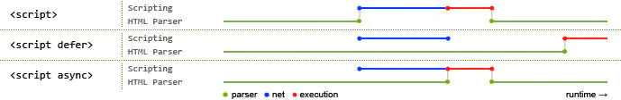

# windowAPI

主要是记录 windowAPI 的使用

## defer / async

defer 和 async 都是异步加载

defer 具有推迟的意思,就是说当 Dom 树加载完毕之后执行，可以获取真实的 dom
async 是只自己加载完毕，就立即执行，会阻塞 dom 的渲染



```js
<script async src="js/vendor/jquery.js"></script>

<script async src="js/script2.js"></script>

<script async src="js/script3.js"></script>
```
### async
:::tip
三者的调用顺序是不确定的。  
jquery.js 可能在 script2 和 script3 之前或之后调用，如果这样，后两个脚本中依赖 jquery 的函数将产生错误，因为脚本运行时 jquery 尚未加载
:::
### defer
:::tip
添加 defer 属性的脚本将**按照在页面中出现的顺序加载**，
因此第二个示例可确保 jquery.js 必定加载于 script2.js 和 script3.js 之前，
同时 script2.js 必定加载于 script3.js 之前。
:::
脚本调用策略小结：
- 如果脚本无需等待页面解析，且无依赖独立运行，那么应使用 async。
- 如果脚本需要等待页面解析，且依赖于其它脚本，调用这些脚本时应使用 defer，将关联的脚本按所需顺序置于 HTML 中。


## Promise

### all

```vue
<script setup>
import { ref } from "vue";
let all = ref([]);

Promise.all([]).then(res => {
  all.value = res;
});
</script>
```

<script setup>
import {ref} from "vue"
let all = ref([])
Promise.all([]).then(res=>{
  all.value = res
})

let race = ref('')
Promise.race([]).then(res=>{
  race.value = res
})
</script>
<p>Promise.all([])的结果是:{{all}}</p>

### race

```vue
<script setup>
import { ref } from "vue";
let race = ref("");

Promise.race([]).then(res => {
  race.value = res;
});
</script>
```

<p>Promise.race([])的结果是:{{race}}</p>

## [URLSearchParams](https://developer.mozilla.org/zh-CN/docs/Web/API/URLSearchParams)

返回一个`iterator`，可以有 `values`,`keys`,`entries`

### 传入参数

1. 传入对象

```js
var params4 = new URLSearchParams({ foo: 1, bar: 2 });
console.log(params4.toString()); // foo=1&bar=2
```

2. 传入 `entries`

```js
var params3 = new URLSearchParams([
  ["foo", 1],
  ["bar", 2],
]);
console.log(params3.toString()); // // foo=1&bar=2
```

3. 传入字符串

```js
var searchParams = new URLSearchParams("key1=value1&key2=value2");
// key1,value1
// key2,value2
for (var pair of searchParams.entries()) {
  console.log(pair[0] + ", " + pair[1]);
}

var url = new URL("https://example.com?foo=1&bar=2");
// url.search = foo=1&bar=2
var params = new URLSearchParams(url.search);
console.log(params.toString());
```

### 方法

#### append

```js
let url = new URL("https://example.com?foo=1&bar=2");
let params = new URLSearchParams(url.search.slice(1));

//添加第二个 foo 搜索参数。
params.append("foo", 4);
//查询字符串变成：'foo=1&bar=2&foo=4'
```

#### get

```js
let params = new URLSearchParams("name=Jonathan&age=18");
let name = params.get("name"); // is the string "Jonathan"
let age = parseInt(params.get("age"), 10); // is the number 18
let address = params.get("address"); // null
```

#### has

```js
let url = new URL("https://example.com?foo=1&bar=2");
let params = new URLSearchParams(url.search.slice(1));

params.has("bar") === true; //true
```

#### keys

```js
// 建立一个测试用 URLSearchParams 对象
var searchParams = new URLSearchParams("key1=value1&key2=value2");

// 输出键值对
for (var key of searchParams.keys()) {
  console.log(key);
}
```

#### values

```js
// 创建一个测试用 URLSearchParams 对象
var searchParams = new URLSearchParams("key1=value1&key2=value2");

// 输出值
for (var value of searchParams.values()) {
  console.log(value);
}
```

### [URL.createObjectURL()](https://developer.mozilla.org/zh-CN/docs/Web/API/URL/createObjectURL_static)

```js
objectURL = URL.createObjectURL(object);
```

:::info
object
用于创建 URL 的 File 对象、Blob 对象或者 MediaSource 对象。
返回值
一个 DOMString 包含了一个对象 URL，该 URL 可用于指定源 object 的内容。
:::

:::warning
内存管理
在每次调用 createObjectURL() 方法时，都会创建一个新的 URL 对象，即使你已经用相同的对象作为参数创建过。当不再需要这些 URL 对象时，每个对象必须通过调用 URL.revokeObjectURL() 方法来释放。
:::

```js
var img = document.createElement("img");
// createObjectURL会生成一个 localhost:8080/xxxxx
img.src = window.URL.createObjectURL(files[i]);
img.height = 60;
img.onload = function () {
  window.URL.revokeObjectURL(this.src);
};
```

### [FileReader](https://developer.mozilla.org/zh-CN/docs/Web/API/FileReader)

:::info
FileReader 对象允许 Web 应用程序异步读取存储在用户计算机上的文件（或原始数据缓冲区）的内容，使用 File 或 Blob 对象指定要读取的文件或数据。

---

其中 File 对象可以是来自用户在一个\<input>元素上选择文件后返回的 FileList 对象，也可以来自拖放操作生成的 DataTransfer 对象
:::

#### 方法

##### FileReader.readAsDataURL()

开始读取指定的 Blob 中的内容。一旦完成，result 属性中将包含一个 **data: URL** 格式的 **Base64 字符串**以表示所读取文件的内容。

##### FileReader.readAsText()

开始读取指定的 Blob 中的内容。一旦完成，result 属性中将包含一个字符串以表示所读取的文件内容。

### [🚀structuredClone](https://developer.mozilla.org/zh-CN/docs/Web/API/structuredClone)

```js {6}
// Create an object with a value and a circular reference to itself.
const original = { name: "MDN" };
original.itself = original;

// Clone it
const clone = structuredClone(original);

console.assert(clone !== original); // the objects are not the same (not same identity)
console.assert(clone.name === "MDN"); // they do have the same values
console.assert(clone.itself === clone); // and the circular reference is preserved
```

## JSON

### JSON.stringify

```js
console.log(JSON.stringify({ x: 5, y: 6 }));
// Expected output: "{"x":5,"y":6}"

console.log(
  JSON.stringify([new Number(3), new String("false"), new Boolean(false)])
);
// Expected output: "[3,"false",false]"

console.log(JSON.stringify({ x: [10, undefined, function () {}, Symbol("")] }));
// Expected output: "{"x":[10,null,null,null]}"

console.log(JSON.stringify(new Date(2006, 0, 2, 15, 4, 5)));
// Expected output: ""2006-01-02T15:04:05.000Z""
```

#### 描述

`JSON.stringify()` 将值转换为相应的 JSON 格式：

- 转换值如果有 toJSON() 方法，使用其返回值
- 布尔值、数字、字符串的包装对象在序列化过程中会自动转换成对应的原始值
- 函数、undefined 和 Symbol 单独转化返回 `undefined`,如果出现在 **数组** 中，转化为 null
- 循环引用会报错
- Date 类型调用 `toString`,转化为字符串
- NaN、infinite 和 null 转化 为 null

```js
JSON.stringify([new Number(1), new String("false"), new Boolean(false)]);
// '[1,"false",false]'

JSON.stringify({ x: undefined, y: Object, z: Symbol("") });
// '{}'

JSON.stringify([undefined, Object, Symbol("")]);
// '[null,null,null]'

JSON.stringify({ [Symbol("foo")]: "foo" });
// '{}'

var obj = {
  foo: "foo",
  toJSON: function () {
    return "bar";
  },
};
JSON.stringify(obj); // '"bar"'
JSON.stringify({ x: obj }); // '{"x":"bar"}'
```

### Json.parse

```js
JSON.parse("123"); // 可以
JSON.parse("abcd132"); // 失败,没有引号  // [!code error]
JSON.parse('"abcd132"'); //[!code ++]
// 可以，因为 abcd132 必须限定为一个字符串
var str = '{"name":"小明","age":18}';
// 不能是
var str = "{'name':'小明', 'age':18}";

// 不能用逗号结尾
JSON.parse("[1, 2, 3, 4, ]");
JSON.parse('{"foo" : 1, }');
```

## Error

### RangeError

创建一个 error 实例，表示错误的原因：数值变量或参数超出其有效范围

### ReferenceError

无效引用 ReferenceError（引用错误） 对象代表当一个不存在的变量被引用时发生的错误。

```js
(function (arg) {})(abcde); // abcde 并不存在，使用了一个不存在的变量
```

### SyntaxError

当 Javascript 语言解析代码时,Javascript 引擎发现了 不符合语法规范的 tokens 或 token 顺序时抛出

```js
[1,2,3].forEach(item=>console.log(item);)
// VM714:1 Uncaught SyntaxError: missing ) after argument list
```

### TypeError

变量或参数不属于有效类型  
当传入函数的操作数或参数的类型并非操作符或函数所预期的类型时，将抛出一个 TypeError 类型错误

```js
// 1. 不是一个有效函数
var abcdf = 123;
abcdf();

// 2. 不属于有效类型
a.push(231);
var a = [];
```
##  捕获错误
### 捕获Promise错误
```js
window.addEventListener("unhandledrejection", event => {
	// 要阻止默认事件，否则还是有错误
	event.preventDefault();
	console.warn(`UNHANDLED PROMISE REJECTION: ${event.reason}`);
})

function a() {
	new Promise((resolve, reject) => {
		reject(12);
	});
}
a();
``` 

## 事件

### dragover/drop

:::tip
必须要阻止 元素的 drapover 默认事件，默认事件是打开文件
:::

```vue{4}
<div
  style="width:100px;height:100px;background-color: yellow;"
  @drop="drop"
  @dragover.prevent
  draggable="true">
</div>
<script lang="ts" setup>
  const drop = (e) => {
    console.log(e, "drop")
    e.target.appendChild(dragged);
  }
</script>
```

### 事件捕获
默认是 `false`,冒泡事件
:::info
**事件执行先捕获，后冒泡,但是不执行绑定的函数，否则怎么捕获呢？等遇到父级元素的`cature`之后在执行**
捕获就像捕鱼一样，从上往下执行  
第三个参数传递 **true 使用捕获模式**，先从 window,然后到 people  
:::

:::tip
在 掘金/知乎 这种外链，可以使用这种
:::

```js{6-8}
// 可以有效阻止某些用户没有权限
// 如果想阻拦全局a标签的跳转，使用e.preventDefault
window.addEventListener(
  "click",
  function (e) {
    console.log("window", e.target.nodeName);
    e.stopPropagation();
    e.preventDefault();
  },
  true
);

document.getElementById("people").addEventListener("click", () => {
  console.log("people");
});
```
<iframe src="/demo/冒泡.html" width="100%" height="400"></iframe>

### 阻止事件执行
```js
let abortController = new  AbortController()

inner.addEventListener("click",function(){
  console.log("inner")
},{
  signal:abortController.signal
})

setTimeout(()=>{
  abortController.abort()
},2000)
```
### mouseenter & mouseover

<iframe src="/demo/mouseEnter.html" width="100%" height="400"></iframe>

## Dom
### append & appendChlid
#### append
是比appendChild更加新的api,可以传入多个参数，还可以传入文本，但是没有返回值
```js
let div = document.createElement("div")
let p = document.createElement("p")
div.append(p)

console.log(div.childNodes) // NodeList [ <p> ]

// 插入文本
let div = document.createElement("div")
div.append("Some text")

console.log(div.textContent) // "Some text"

// 传入多个参数
let div = document.createElement("div")
let p = document.createElement("p")
div.append("Some text", p)

console.log(div.childNodes) // NodeList [ #text "Some text", <p> ]
```
#### appendChild
如果将被插入的节点已经存在于当前文档的文档树中，那么 appendChild() 只会将它从原先的位置移动到新的位置，这意味着，一个节点不可能同时出现在文档的不同位置，如果想保留，使用 `Node.cloneNode()` 创建一个副本，再将副本附加到目标父节点下

:::danger
appendChild() 返回的是被附加的子元素,不支持多参数，不支持 string
:::

```js
// 创建一个新的段落元素 <p>，然后添加到 <body> 的最尾部
var p = document.createElement("p");
document.body.appendChild(p);
```