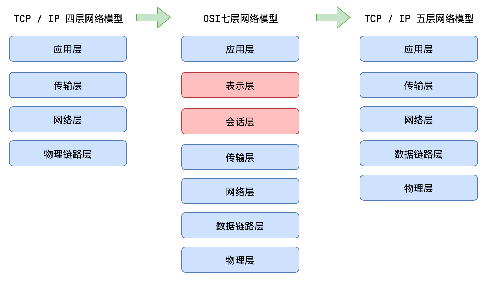

# 浏览器
在网络层面，对于前端开发者，必须要知道浏览器拥有的两大核心能力：
- 自动发出请求的能力
- 自动解析响应的能力

当发送GET请求时，浏览器不会附带请求体
1. GET 请求只能传递 ASCII 数据，遇到非 ASCII 数据需要进行编码；POST 请求没有限制
2. POST 不会被保存到浏览器的历史记录中
3. 刷新页面时，若当前的页面是通过 POST 请求得到的，则浏览器会提示用户是否重新提交。若是 GET 请求得到的页面则没有提示。

自动解析响应的能力
1. 浏览器能够自动识别响应码，当出现一些特殊的响应码时浏览器会自动完成处理，比如301( 永久 重定向 )、302(  临时重定向 )
2. 根据响应结果做不同的处理浏览器能够自动分析响应头中的Content-Type，根据不同的值进行不同处理，比如：
  - text/plain: 普通的纯文本，浏览器通常会将响应体原封不动的显示到页面上
  - text/html：html文档，浏览器通常会将响应体作为页面进行渲染
  - text/javascript或application/javascript：js代码，浏览器通常会使用JS执行引擎将它解析执行
  - text/css：css代码，浏览器会将它视为样式
  - image/jpeg：浏览器会将它视为jpg图片
  - application/octet-stream：二进制数据，会触发浏览器下载功能
  - attachment：附件，会触发下载功能该值和其他值不同，应放到Content-Disposition头中。


## 网络





## 数据格式
### post
form-data 和 application/x-www-form-urlencoded 

:::tip
- 数据包格式的区别，
- 数据包中非ANSCII字符怎么编码，是百分号转码发送还是直接发送
:::

#### application/x-www-form-urlencoded

我们可以看出，服务器知道参数用符号&间隔，如果参数值中需要&，则必须对其进行编码。编码格式就是application/x-www-form-urlencoded（将键值对的参数用&连接起来，如果有空格，将空格转换为+加号；有特殊符号，将特殊符号转换为ASCII HEX值）。

application/x-www-form-urlencoded是 **浏览器默认** 的编码格式。对于Get请求，是将参数转换?key=value&key=value格式，连接到url后

```html
<form action="http://localhost:8888/task/" method="POST">
First name: <input type="text" name="firstName" value="Mickey&"><br>
Last name: <input type="text" name="lastName" value="Mouse "><br>
<input type="submit" value="提交">
</form>
```


#### form-data

multipart/form-data是基于post方法来传递数据的，并且其请求内容格式为Content-Type: multipart/form-data,用来指定请求内容的数据编码格式  

请求体内容各字段之间以--${boundary}来进行分割,以--${boundary}--来结束请求体内容
```txt
POST http://www.example.com HTTP/1.1
Content-Type:multipart/form-data; boundary=----WebKitFormBoundaryyb1zYhTI38xpQxBK

------WebKitFormBoundaryyb1zYhTI38xpQxBK
Content-Disposition: form-data; name="city_id"

1

------WebKitFormBoundaryyb1zYhTI38xpQxBK
Content-Disposition: form-data; name="company_id"

2
------WebKitFormBoundaryyb1zYhTI38xpQxBK
Content-Disposition: form-data; name="file"; filename="chrome.png"
Content-Type: image/png

PNG ... content of chrome.png ...
------WebKitFormBoundaryyb1zYhTI38xpQxBK--

```
##### FormData对象
XMLHttpRequest Level 2添加了一个新的接口FormData。利用FormData对象，我们可以通过JavaScript用一些键值对来模拟一系列表单控件，我们还可以使用XMLHttpRequest的send()方法来异步的提交这个"表单"。
```js
var formData = new FormData();
formData.append("username", "Groucho");
formData.append("accountnum", 123456); 
fetch('/users', {
  method: 'POST',
  body: formData
})
```
通过fetch进行ajax请求时，会自动为其将其转为form-data格式，无需手动添加格式

## [跨域](http://ruanyifeng.com/blog/2016/04/cors.html)


:::danger
虽然跨域，但是服务器依然可以收发响应，只是浏览器拦截
:::

浏览器将CORS请求分成两类：简单请求（simple request）和非简单请求（not-so-simple request）

只要同时满足以下两大条件，就属于简单请求。

```txt
(1) 请求方法是以下三种方法之一：

- HEAD
- GET
- POST

(2)HTTP的头信息不超出以下几种字段：

- Accept
- Accept-Language
- Content-Language
- Last-Event-ID
- Content-Type：只限于三个值application/x-www-form-urlencoded、multipart/- form-data、text/plain
```
这是为了兼容表单（form），因为历史上表单一直可以发出跨域请求。AJAX 的跨域设计就是，只要表单可以发，AJAX 就可以直接发。

复杂请求需要发送一个 **预检请求**

> 对于预见请求，其实就是在发送请求之前，浏览器会先去服务器跑一趟，只携带着请求头，询问服务器是否放行，如果服务器同意，则会发送真实请求
> 


### 细节
#### - 关于cookie
默认情况下，ajax的跨域请求并不会附带cookie

```js
// xhr
var xhr = new XMLHttpRequest();
xhr.withCredentials = true;

// fetch api
fetch(url, {
  credentials: "include"
})
```
当一个请求需要附带cookie时，无论它是简单请求，还是预检（preflight）请求，都会在请求头中添加cookie字段

而服务器响应时，需要明确告知客户端：服务器允许这样的凭据

告知的方式也非常的简单，只需要在响应头中添加：**Access-Control-Allow-Credentials: true** 即可

对于一个附带身份凭证的请求，若服务器没有明确告知，浏览器仍然视为跨域被拒绝。
另外要特别注意的是：对于附带身份凭证的请求，服务器不得设置 Access-Control-Allow-Origin 的值为*。这就是为什么不推荐使用**\***的原因
#### - 关于跨域获取响应头
在跨域访问时，JS只能拿到一些最基本的响应头，如：Cache-Control、Content-Language、Content-Type、Expires、Last-Modified、Pragma，如果要访问其他头，则需要服务器设置本响应头。

`Access-Control-Expose-Headers` 头让服务器把允许浏览器访问的头放入白名单，例如
服务器回应的其他CORS相关字段如下:
```js
Access-Control-Allow-Methods: GET, POST, PUT //
 // 该字段必需，它的值是逗号分隔的一个字符串，表明服务器支持的所有跨域请求的方法
Access-Control-Allow-Headers: X-Custom-Header
// 如果浏览器请求包括Access-Control-Request-Headers字段，
// 则Access-Control-Allow-Headers字段是必需的。它也是一个逗号分隔的字符串，
// 表明服务器支持的所有头信息字段，不限于浏览器在"预检"中请求的字段
Access-Control-Allow-Credentials: true
// 该字段与简单请求时的含义相同。
Access-Control-Max-Age: 1728000
// 该字段可选，用来指定本次预检请求的有效期，单位为秒。上面结果中，有效期是20天（1728000秒），
 // 即允许缓存该条回应1728000秒（即20天），在此期间，不用发出另一条预检请求
// Access-Control-Allow-Origin 字段是每次回应都必定包含的
```

#### 否定预检请求
:::tip
如果服务器否定了"预检"请求，会返回一个正常的HTTP回应，但是没有任何CORS相关的头信息字段
这时，浏览器就会认定，服务器不同意预检请求，因此触发一个错误，被XMLHttpRequest对象的 **onerror回调函数**捕获
:::

## Referrer-Policy

:::tip
当用户在浏览器上点击一个链接时，会产生一个 HTTP 请求，用于获取新的页面内容，而在该请求的报头中，会包含一个 Referrer，用以指定该请求是从哪个页面跳转页来的，常被用于分析用户来源等信息。

但是也有成为用户的一个不安全因素，比如有些网站直接将 sessionid 或是 token 放在地址栏里传递的，会原样不动地当作 Referrer 报头的内容传递给第三方网站
:::


### 指令值
```ts
enum ReferrerPolicy {
  "",
  "no-referrer",
  "no-referrer-when-downgrade",
  "same-origin",
  "origin",
  "strict-origin",
  "origin-when-cross-origin",
  "strict-origin-when-cross-origin",
  "unsafe-url"
}
```
- no-referrer
整个 Referer 首部会被移除。访问来源信息不随着请求一起发送。

- no-referrer-when-downgrade（默认值）
在没有指定任何策略的情况下用户代理的默认行为。在同等安全级别的情况下，引用页面的地址会被发送 (HTTPS->HTTPS)，但是在降级的情况下不会被发送 (HTTPS->HTTP)。

- origin
在任何情况下，仅发送文件的源作为引用地址。例如 https://example.com/page.html 会将 https://example.com/ 作为引用地址。

- origin-when-cross-origin
对于同源的请求，会发送完整的 URL 作为引用地址，但是对于非同源请求仅发送文件的源。

- same-origin
对于同源的请求会发送引用地址，但是对于非同源请求则不发送引用地址信息。

- strict-origin
在同等安全级别的情况下，发送文件的源作为引用地址 (HTTPS->HTTPS)，但是在降级的情况下不会发送 (HTTPS->HTTP)。

- strict-origin-when-cross-origin
对于同源的请求，会发送完整的 URL 作为引用地址；在同等安全级别的情况下，发送文件的源作为引用地址 (HTTPS->HTTPS)；在降级的情况下不发送此首部 (HTTPS->HTTP)。

- unsafe-url
无论是同源请求还是非同源请求，都发送完整的 URL（移除参数信息之后）作为引用地址。


### 集成到 HTML
```html
<meta name="referrer" content="origin">
```
```html
<a href="http://example.com" referrerpolicy="origin">
  <!-- 或者 -->
<a href="http://example.com" rel="noreferrer">
```

## 正向代理与 反向代理
### 正向代理
>如果你去访问 git 的时候，是访问不了的，你 需要 访问 一台可以 访问 git 的服务器
> 客户端 去 访问 这个代理服务器 ，代理服务器 去访问 git

客户端知道 要访问的是哪个服务器，服务器 只知道 是哪个 代理的服务器访问的 ，并不知道是哪一个 客户端 访问的
客户端必须设置正向代理服务器，当然前提是要知道正向代理服务器的 IP 地址，还有代理程序的端口

#### 定义
总结来说：正向代理，"它代理的是客户端"，是一个位于客户端和原始服务器（Origin Server）之间的服务器，为了从原始服务器取得内容，客户端向代理发送一个请求并指定目标（原始服务器）。

然后代理向原始服务器转交请求并将获得的内容返回给客户端。客户端必须要进行一些特别的设置才能使用正向代理。

#### 正向代理的用途
- 访问原来无法访问的资源，如 Google。
- 可以做缓存，加速访问资源。
- 对客户端访问授权，上网进行认证。
- 代理可以记录用户访问记录（上网行为管理），对外隐藏用户信息


### 反向代理
> 我国的某宝网站，每天同时连接到网站的访问人数已经爆表，单个服务器远远不能满足人民日益增长的购买欲望了
> 出现了分布式部署，通过多台服务器来解决访问人数限制的问题
>
####  定义
多个客户端给服务器发送的请求，Nginx 服务器接收到之后，按照一定的规则分发给了后端的业务处理服务器进行处理了
此时请求的来源也就是客户端是明确的，但是请求具体由哪台服务器处理的并不明确了，Nginx 扮演的就是一个反向代理角色。

反向代理，**"它代理的是服务端"**，主要用于服务器集群分布式部署的情况下，反向代理隐藏了服务器的信息。
#### 反向代理的作用
- 保证内网的安全，通常将反向代理作为公网访问地址，Web 服务器是内网。
- 负载均衡，通过反向代理服务器来优化网站的负载。


### 负载均衡
这里提到的客户端发送的、Nginx 反向代理服务器接收到的请求数量，就是我们说的负载量。请求数量按照一定的规则进行分发，到不同的服务器处理的规则，就是一种均衡规则。
所以将服务器接收到的请求按照规则分发的过程，称为负载均衡。

## 网络攻击
### xss
**cross site script(跨站点脚本)**
将 js 脚本插入到 网页内容中，渲染时执行 js 脚本
方法： 替换特殊字符
### csrf
cross site request forgery(跨站请求伪造)

诱导用户请求另一个网站
有一个a 网站，点击按钮 到 b 网站，在 b 网站的时候 ，并发起 a 网站的请求，a 网站会以为是用户自己发起的
比如：一个 gmail 网站，点击按钮到 b网站，在b网站中 转发邮件，由于 带了 a 网站的 cookie
，所以可以执行
方法：预防 跨域 sameSite，验证码，referrer
### click jacking 点击劫持
界面上蒙了一层透明的 iframe，诱导去点击
