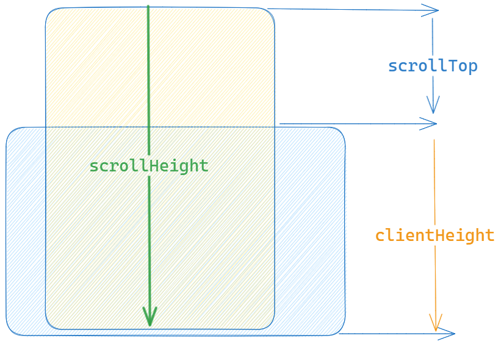

# 无限滚动
[🔗elememt-plus基础用法](https://element-plus.gitee.io/zh-CN/component/infinite-scroll.html#%E5%9F%BA%E7%A1%80%E7%94%A8%E6%B3%95)
## 使用
```vue{4-8}
<template>
  <div class="outer">
    <ul class="list" 
    :infinite-scroll-delay="300" 
    :infinite-scroll-distance="20" 
    :infinite-scroll-immediate="true"
    :infinite-scroll-disabled="disabled" 
    v-infinite-scroll="load"
    >
      <li v-for="i in count" class="list-item">{{ i }}</li>
    </ul>
    <p v-if="loading" class="tip">加载中...</p>
    <p v-if="noMore" class="tip">没有更多了</p>
  </div>
</template>

<script lang="ts">
  const load = () => {
    loading.value = true
    setTimeout(() => {
      count.value += 2
      loading.value = false
    }, 1000)
  }
</script>
```

与上一篇无限滚动的区别在于**参数来自于元素的属性,检测触底状态**，但是思路是一致的  
## 重点
### 触底状态
滚动元素的内容高度 = 可视区域的高度 + 滚动元素距离顶部的高度
- [scrollHeight](https://developer.mozilla.org/zh-CN/docs/Web/API/Element/scrollHeight)


- [clientHeight](https://developer.mozilla.org/zh-CN/docs/Web/API/Element/clientHeight)


- [scrollTop](https://developer.mozilla.org/zh-CN/docs/Web/API/Element/scrollTop)  
Element.scrollTop 属性可以获取或设置一个元素的内容垂直滚动的像素数。  

一个元素的 scrollTop 值是这个元素的内容顶部（卷起来的）到它的视口可见内容（的顶部）的距离的度量。当一个元素的内容没有产生垂直方向的滚动条，那么它的 scrollTop 值为0。

---

**所以，`el.scrollHeight = el.clientHeight + el.scrollTop` 即可以判定已经到达底部**


### 填充父元素
可以设置 `immediate`属性 ,立即加载数据直到触底为止

原理在于使用 [`MutationObserver`](https://developer.mozilla.org/zh-CN/docs/Web/API/MutationObserver/MutationObserver) 检测`Dom`变化
```ts
let observe = new MutationObserver(onScroll)
observe.observe(container, {
    childList: true,// 观察目标子节点的变化
    subtree: true // 观察后代节点
})
onScroll()
```

## 效果
<scrollList/>

<script setup>
  import scrollList from '../../../src/components/InfiniteScroll.vue'
</script>

## 源码
<<< ../../../src/components/InfiniteScroll.vue
