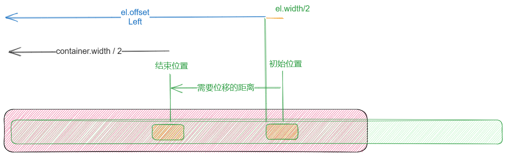

# tab
**可以滚动的tab**
> 项目终于上线了,可以好好的休息一阵了
## 效果
<Tab/>
<script setup>
import Tab from '../../../src/components/tab.vue'
</script>

## 思路
1. 布局  
   外层容器固定宽度，内层容器宽度自适应,使用 `flex,flex-nowrap`使里面的 `item`横向, 每一个 `tabItem` 的宽度是 `min-width=fit-content`，保证内容的完整性,底部的 `scrollBar` 是绝对定位
2. **滚动居中**  
   这个也是这个组件的核心，滚动的时候，需要计算出当前的 `tabItem` 的 `offsetLeft`，然后设置 `外层容器` 的 `transformX` 值，让滚动条居中  

   核心代码:  
   `const left: number = tab.offsetLeft + tab.offsetWidth / 2 - scroller.value.offsetWidth / 2;`



3. 底部滚动条
   底部滚动条是绝对定位的，所以需要计算出当前的 `tabItem` 的 `offsetLeft`，然后设置 `滚动条` 的 `transformX` 值,造成跟随现象


## 源码
```vue:line-numbers{46}
<template>
  <div class="w-[400px] overflow-hidden tab-bar mx-auto bg-blue-400 text-gray-200 rounded-sm shadow-md shadow-orange-200">
    <div class="overflow-x-auto relative flex gap-2 flex-nowrap h-10 cursor-pointer" ref="scroller">
      <div v-for="i of tabs" :key="i" class="flex-1 h-full  px-4 
      flex justify-center items-center text-white  font-bold min-w-fit" :class="[
        currentTab == i - 1 && ['bg-red-200 text-blue-800']]" :ref="setDom" @click="clickTab(i - 1)">
        选项{{ i }}
      </div>
      <div class="h-1 absolute bottom-0  bg-green-300 transition-transform duration-200" :style="{
        transform: `translateX(${indicatorX}px)`,
        width: `${tabDom[currentTab]?.offsetWidth}px`
      }">
      </div>
    </div>
  </div>
</template>
<script lang="ts" setup>
import { onMounted, ref, computed, reactive, watch } from "vue";
const tabs = ref(10)
import { scrollTo, linear } from "../utils/elements"
const tabDom = ref<Array<HTMLElement | null>>([]);
const scroller = ref<HTMLElement | null>(null);
/**
* @const 当前 选中的tab 下标
*/ 
const currentTab = ref(0);

/**
 * @cosnt 滚动条位移距离
*/
const indicatorX = ref(0);

/**
 * 移动底部滚动条
 */
const moveIndicator = (tab: HTMLElement) => {
  if (!scroller.value) return;
  indicatorX.value = tab.offsetLeft;
}

/**
 * 滚动居中
 */
const scrollToCenter = (tab: HTMLElement) => {
  if (!scroller.value) return;
  const left: number = tab.offsetLeft + tab.offsetWidth / 2 - scroller.value.offsetWidth / 2;
  scrollTo(scroller.value, {
    left,
    animation: linear
  })
}

const clickTab = (i: number) => {
  currentTab.value = i;
  const tab = tabDom.value[i];
  if (!tab) return

  moveIndicator(tab)
  scrollToCenter(tab)
}

const setDom = (el: any) => {
  tabDom.value.push(el)
}
</script>

<style lang="scss" scoped>
.tab-bar {
  ::-webkit-scrollbar {
    display: none;
  }
}
</style>
```

