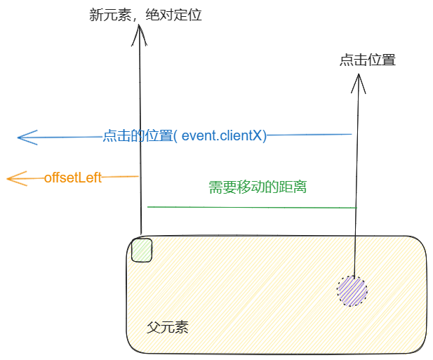
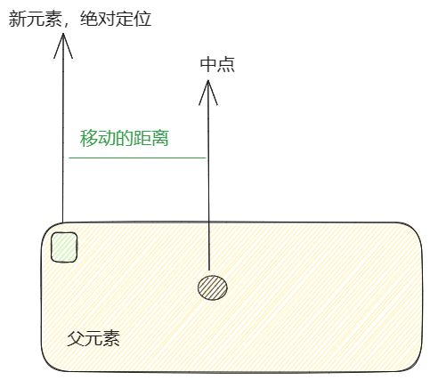

# Rippele
> 使用指令形式调用水波纹

## 使用
```vue
<template>
    <div v-ripple class="h-[100px] mx-auto w-[345px] bg-gray-200"></div>
</template>

<script setup>
  import vRipple from "./plugins/ripple"
</script>
```
## 效果
<ClientOnly>

  <div v-ripple class="h-[100px] mx-auto w-[345px] bg-gray-200"></div>

  <script setup>
    import vRipple from "../../../src/plugins/ripple.ts"
  </script>

  <style lang="scss">
    .var-ripple {
      transition: transform 0.2s cubic-bezier(0.68, 0.01, 0.62, 0.6), opacity 0.14s linear;
      opacity: 0;
      will-change: transform, opacity;
      @apply absolute inset-0 bg-red-600 transition-all rounded-full;
    } 
   </style> 
</ClientOnly>

## 思路
核心思路:
1. 创建一个新的 `div` 插入到此元素中,对新的元素添加`绝对定位`,定位到`left:0,top:0`
2. 对新的元素根据父元素动态添加 `width/height`
3. 根据点击位置添加`transform`,先把新元素**移动到点击的位置**,然后移动到**父元素的中心位置**
4. 添加`opacity`动画,让新元素逐渐显示/隐藏

重点:
1. 确定新元素的 `width/height` 
     
> 为了保证新元素可以覆盖父元素,新元素可以选取父元素 `width/height` 中的最大值,也可以选取 `Math.sqrt(clientWidth ** 2 + clientHeight ** 2)`作为宽高
2. 确定初始位置/移动位置  
  >  确定`width/height`之后,新元素移动到点击位置,然后移动到父元素中心位置,可以采用`translate`或者`translateX`
  - 移动到点击位置
    

    使用 `scale3d 缩放元素`  
    **ripple.style.transform = `translate(${x}px, ${y}px) scale3d(.3,.3,.3)`;**
  - 移动到父元素的中心位置
     
     然后扩大元素  
     **ripple.style.transform = `translate(${centerX}px, ${centerY}px) scale3d(1, 1, 1)`;**

## source
```ts:line-numbers
import { type Directive, type DirectiveBinding } from "vue";

interface RippleOptions {
  removeRipple: any;
  color?: string;
  disabled?: boolean;
  tasker?: number | null;
}

interface RippleHTMLElement extends HTMLElement {
  _ripple?: RippleOptions;
}

interface RippleStyles {
  x: number;
  y: number;
  centerX: number;
  centerY: number;
  size: number;
}

const ANIMATION_DURATION = 250;

 function removeRipple(this: RippleHTMLElement) {
  const _ripple = this._ripple as RippleOptions;
  const task = () => {
    const ripples: NodeListOf<RippleHTMLElement> =
      this.querySelectorAll(".var-ripple");
    if (!ripples.length) {
      return;
    }

    const lastRipple: RippleHTMLElement = ripples[ripples.length - 1];

    window.setTimeout(() => {
      lastRipple.style.opacity = `0`;

      window.setTimeout(
        () => lastRipple.parentNode?.removeChild(lastRipple),
        ANIMATION_DURATION
      );
    }, 200);
  };

  _ripple.tasker ? window.setTimeout(task, 30) : task();
}

function computeRippleStyles(
  element: RippleHTMLElement,
  event: MouseEvent
): RippleStyles {
  // 获取元素的位置
  const { top, left } = element.getBoundingClientRect();
  // 获取元素的宽高
  const { clientWidth, clientHeight } = element;

  // 半径
  const radius = Math.sqrt(clientWidth ** 2 + clientHeight ** 2) / 2;
  // 宽高
  const size = radius * 2;

  // 在父元素内相对父元素的点击的坐标
  const localX: number = event.clientX - left;
  const localY: number = event.clientY - top;

  // 生成的div移动的距离,元素的中心
  const centerX: number = clientWidth / 2 - radius;
  const centerY: number = clientHeight / 2 - radius;

  // 容器移动到 点击的位置内部的中心
  const x: number = localX - size / 2;
  const y: number = localY - size / 2;

  return { x, y, centerX, centerY, size };
}

function setStyles(element: RippleHTMLElement) {
  const { zIndex, position } = getComputedStyle(element);
  element.style.overflow = "hidden";
  position === "static" && (element.style.position = "relative");
  zIndex === "auto" && (element.style.zIndex = "1");
}

function createRipple(this: RippleHTMLElement, event: MouseEvent) {
  const _ripple = this._ripple as RippleOptions;
  _ripple.removeRipple();

  const task = () => {
    const { x, y, centerX, centerY, size }: RippleStyles = computeRippleStyles(
      this,
      event
    );

    const ripple: RippleHTMLElement = document.createElement("div");

    ripple.classList.add("var-ripple");
    ripple.style.opacity = `0`;
    ripple.style.transform = `translate(${x}px, ${y}px) scale3d(.3,.3,.3)`;
    ripple.style.width = `${size}px`;
    ripple.style.height = `${size}px`;
    setStyles(this);
    this.appendChild(ripple);
    window.setTimeout(() => {
      ripple.style.transform = `translate(${centerX}px, ${centerY}px) scale3d(1, 1, 1)`;
      ripple.style.opacity = `.25`;
      setTimeout(() => {
        _ripple.removeRipple();
      }, 200);
    }, 20);
  };
  _ripple.tasker = window.setTimeout(task, 30);
}
function mounted(
  el: RippleHTMLElement,
  binding: DirectiveBinding<RippleOptions>
) {
  el._ripple = {
    tasker: null,
    ...(binding.value ?? {}),
    removeRipple: removeRipple.bind(el),
  };
  el.addEventListener("click", createRipple, { passive: true });
}

const Ripple: Directive = {
  mounted,
};
export default Ripple;
```
```scss
.var-ripple {
  transition: transform 0.2s $--ripple-cubic-bezier, opacity 0.14s linear;
  opacity: 0;
  background-color: $--ripple-color;
  will-change: transform, opacity;
  @apply absolute inset-0 bg-red-600 transition-all rounded-full;
}
```