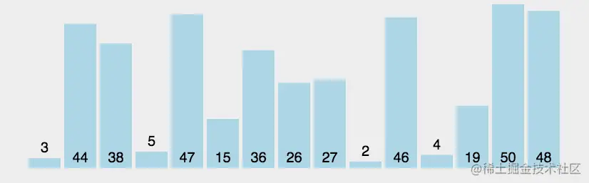
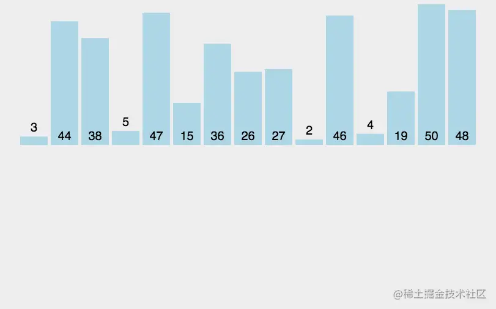
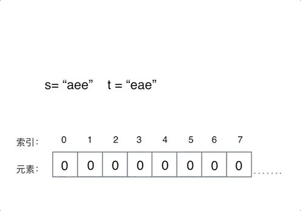

# 算法

**常用的算法**

## [排序](https://juejin.cn/post/7219249005905149989)

### 冒泡排序


```ts
function bubbleSort(arr){
  var len = arr.length;
  for(let i = 0;i<len-1;i++){
    for(let j = 0;j<len-i-1;j++){
      // 元素两两对比,和我后面的元素进行比较
      // 如果我比后面的元素还要大,需要交换位置
      if(arr[j] > arr[j+1]){
        [arr[j+1],arr[j]] = [arr[j],arr[j+1]]
      }
    }
  }
}
```


### 快速排序

```js
  function quickSort(arr){
  if (arr.length <= 1) return arr;
  let left = [],right = [],cur = arr[0];

  for(let i =1;i<arr.length;i++){
    if(arr[i]>cur){
      right.push(arr[i])
    }else {
      left.push(arr[i])
    }
  }
  return quickSort(left).concat(cur,quickSort(right))
}
```

### 插入排序



```js
  function insertedSort(arr) {
	for (let j = 1; j < arr.length; j++) {
		let i = j - 1, curr = arr[j];
		// curr 是 未排序的第一项，i 是拍完序 的最后一项下标
		while (i > 0 && curr < arr[i]) {
			arr[i + 1] = arr[i]
			i--
		}
		arr[i + 1] = curr
	}
}
insertedSort([1, 2, 4, 3]) // [1,2,3,4]
```

### 选择排序
找到最小值,然后进行交换
```js
    function selectedSort(arr) {
      //2. 执行 n - 1 次
      for (let i = 0; i < arr.length; i++) {
     // 1. 选择 最小值，然后把 这个最小值 与头部进行交换，找到的最小值就不再遍歷了
        let minIndex = i;
        for (let j = i; j < arr.length; j++) {
          if (arr[j] < arr[minIndex]) {
            minIndex = j;
          }
        }
        [arr[i], arr[minIndex]] = [arr[minIndex], arr[i]];
      }
      return arr;
}
```

## 数组

### [二分查找](https://programmercarl.com/0704.%E4%BA%8C%E5%88%86%E6%9F%A5%E6%89%BE.html)

---
#### 左闭右闭区间
因为这个 right 是可以访问到的,所以 `right = mid -1`
```js {5,10}
  var search = function(nums, target) {
    // right是数组最后一个数的下标，num[right]在查找范围内，是左闭右闭区间
    let mid, left = 0, right = nums.length - 1;
    // 当left=right时，由于nums[right]在查找范围内，所以要包括此情况
    while (left <= right) {
        // 位运算 + 防止大数溢出
        mid = left + ((right - left) >> 1);
        // 如果中间数大于目标值，要把中间数排除查找范围，所以右边界更新为mid-1；如果右边界更新为mid，那中间数还在下次查找范围内
        if (nums[mid] > target) {
            right = mid - 1;  // 去左面闭区间寻找
        } else if (nums[mid] < target) {
            left = mid + 1;   // 去右面闭区间寻找
        } else {
            return mid;
        }
    }
    return -1;
};
```

#### 左闭右开区间
right 访问不到,所以可以 使用 `right = mid`
```js{5,12}
var search = function(nums, target) {
  // right是数组最后一个数的下标+1，nums[right]不在查找范围内，是左闭右开区间
  let mid, left = 0, right = nums.length;
  // 当left=right时，由于nums[right]不在查找范围，所以不必包括此情况
  while (left < right) {
    // 位运算 + 防止大数溢出
    mid = left + ((right - left) >> 1);
    // 如果中间值大于目标值，中间值不应在下次查找的范围内，但中间值的前一个值应在；
    // 由于right本来就不在查找范围内，所以将右边界更新为中间值
    // 如果更新右边界为mid-1则将中间值的前一个值也踢出了下次寻找范围
    if (nums[mid] > target) {
      right = mid;
    } else if (nums[mid] < target) {
      left = mid + 1;
    } else {
      return mid;
    }
  }
  return -1;
};
```

## 🔥双指针

**双指针法(快慢指针法): 通过一个快指针和慢指针在一个 for 循环下完成两个 for
循环的工作**

定义快慢指针

- 快指针：**寻找新数组的元素**, 新数组就是不含有目标元素的数组
- 慢指针：指向**更新 新数组下标的位置**

### 移除元素

> 给你一个数组 nums 和一个值 val，你需要 原地 移除所有数值等于 val 的元素，并返
> 回移除后数组的新长度。不要使用额外的数组空间，你必须仅使用 O(1) 额外空间并原地
> 修改输入数组

:::info 思路
  快指针去遍历寻找新的元素, 慢指针是所有不等于 val 的下标 
:::


```ts
function removeElement(nums: number[], val: number): number {
  let slowIndex = 0
  for(let fastIndex = 0;fastIndex< nums.length;fastIndex ++ ){
    if(nums[fastIndex] !== val){
      nums[slowIndex ++ ] = nums[fastIndex]
    }
  }
  return slowIndex
};
```


### 移动 0

> 给定一个数组 nums，编写一个函数将所有 0 移动到数组的末尾，同时保持非零元素的相
> 对顺序。

::: info 思路 
  交换位置, 慢指针 指向最近的不为 0 的值的下标,然后与快指针所对应的
值交换

比如: arr = [1,0,2,0,5] fastIndex = 2 slowIndex = 1 然后 arr[2] 与 arr[1] 进行交换 
:::

```ts
  function moveZeroes(nums: number[]): void {
    let slowIndex = 0;
    for(let fastIndex = 0;fastIndex < nums.length;fastIndex ++){
        if(nums[fastIndex] !== 0){
            [nums[fastIndex],nums[slowIndex]] =  [nums[slowIndex],nums[fastIndex]]
            slowIndex++
        }
    }
};
```

### 删除有序数组中的重复项

```ts
var removeDuplicates = function(nums) {
  let n = 0
  for(let i =0;i<nums.length;i++){
    if(nums[i] == nums[i+1])continue;
    nums[n++] = nums[i]
  }
  return n
}
```

### 有序数组的平方

> 给你一个按 非递减顺序 排序的整数数组 nums, 返回 每个数字的平方 组成的新数组，
> 要求也按非递减顺序 排序。

:::info 思路
  数组是有序的,那么数组平方的最大值是在数组的两端,不是在左边就是在右边

遇见有序数组可以使用双指针  
如果是无序的，则无法使用，因为最大值不是在 左端 或者是在 右端 
:::

```ts
  function sortedSquares(nums: number[]): number[] {
  let i = 0,
    j = nums.length - 1,
    result: Array<number> = [],
    k = nums.length - 1;

// 必须使用 i <= j 否则中间的值 取不到
  while (i <= j) {
    let left = Math.pow(nums[i], 2);
    let right = Math.pow(nums[j], 2);

    if (left < right) {
      result[k--] = right;
      j--;
    } else {
      result[k--] = left;
      i++;
    }
  }
  return result;
}

let r = sortedSquares([-4, -1, 0, 3, 10]);
```

### 合并两个有序数组

既然是有序,就要考虑使用双指针充分利用这个条件

```ts
  function merge(nums1: number[], m: number, nums2: number[], n: number): any {
  let arr = [],
    left = 0,
    right = 0,
    cur;

  while (left < m || right < n) {
    if (m == left) {
      cur = nums2[right++];
    } else if (n == right) {
      cur = nums1[left++];
    } else if (nums1[left] <= nums2[right]) {
      cur = nums1[left++];
    } else if (nums1[left] > nums2[right]) {
      cur = nums2[right++];
    }
    // left + right - 1  要减一
    arr[left + right - 1] = cur;
  }
  // 这个时候 arr 已经和 num1 一样了
  for (let i = 0; i != m + n; i++) {
    nums1[i] = arr[i];
  }
  return nums1;
}

merge([1, 2, 3, 0, 0, 0], 3, [2, 5, 6], 3)
```

## 滑动窗口

滑动窗口主要确定三点:

1. 窗口内是什么
2. 如何移动窗口内的起始位置
3. 如何移动窗口内的结束位置

### 长度最小的子数组

> 给定一个含有 n 个正整数的数组和一个正整数 s ，找出该数组中满足其和 ≥ s 的长度
> 最小的 连续 子数组，并返回其长度。如果不存在符合条件的子数组，返回 0。

- 输入：s = 7, nums = [2,3,1,2,4,3] 输出：2 解释：子数组 [4,3] 是该条件下的长度
  最小的子数组


```ts
function minSubArrayLen(nums: number[], num: number): any {
  let sum = 0,
    len = Infinity,
    j = 0;

  for (let i = 0; i < nums.length; i++) {
    sum += nums[i];
    while (sum >= num) {
      len = Math.min( len, i - j + 1 );
      // 不断的滑动窗口，直到满足, j 一定是递增的
      sum -= nums[j++];
    }
  }
  return len;
}
let r = minSubArrayLen([2, 3, 1, 2, 4, 3], 7);
```

窗口就是 满足其和 ≥ s 的长度最小的 连续 子数组。  
窗口的起始位置如何移动：如果当前窗口的值大于 s 了，窗口就要向前移动了(也就是该缩
小了)。  
窗口的结束位置如何移动：窗口的结束位置就是遍历数组的指针，也就是 for 循环里的索
引。

## hash

**当我们需要查询一个元素是否出现过,或者在一个集合里的时候,可以使用 hash 表**

`set / map / 数组` 都可以算作 hash 表

### 有效的字母异位词

> 给定两个字符串 s 和 t ，编写一个函数来判断 t 是否是 s 的字母异位词

- 输入: s = "anagram", t = "nagaram" 输出: true
- 输入: s = "rat", t = "car" 输出: false



:::info 思路 
因为是字母,所以是 ASCII 码是连续的,所以可以把 字符 `a` 映射为下标
0, 字符 `z` 映射为下标 25

通过数组对应的下标所对应的元素做 +1 操作，如果在另一个字符串中出现了,可以执行 -1
操作

最后如果 record 数组中的所有元素都为 0,可以说明字符串 s 和 t 是字母异构词 
:::

```js
  var isAnagram = function(s, t) {
  if(s.length !== t.length) return false;
  const resSet = new Array(26).fill(0);
  const base = "a".charCodeAt(0);  // code码

  for(const i of s) {
    resSet[i.charCodeAt() - base]++;
  }

  for(const i of t) {
    // 说明不存在
    if(!resSet[i.charCodeAt(0) - base]) return false;
    resSet[i.charCodeAt(0) - base]--;
  }
  return true;
}
```

### 赎金信

> 给定一个赎金信 (ransom) 字符串和一个杂志(magazine)字符串，判断第一个字符串
> ransom 能不能由第二个字符串 magazines 里面的字符构成。如果可以构成，返回 true
> ；否则返回 false。
>
> (题目说明：为了不暴露赎金信字迹，要从杂志上搜索各个需要的字母，组成单词来表达
> 意思。杂志字符串中的每个字符只能在赎金信字符串中使用一次。)

- canConstruct("a", "b") -> false
- canConstruct("aa", "ab") -> false
- canConstruct("aa", "aab") -> true

:::info 
  同样的思路, 使用 map 记录, a-z 作为下标, 下标对应的值为出现的次数 
:::

```ts
  function canConstruct(ransomNote: string, magazine: string): boolean {
    let map = Array(26).fill(0);
    let base = 'a'.charCodeAt(0);

    if(magazine.length < ransomNote.length) return false;

    for(let i = 0;i < magazine.length;i++){
        map[ magazine[i].charCodeAt(0) - base ] +=1
    }

    for(let i = 0;i<ransomNote.length;i++ ){
        if(!map[ ransomNote[i].charCodeAt(0) - base ])return false;
        map[ ransomNote[i].charCodeAt(0) - base] --
    }

    return true
};
```

### 四数之和

> 给你四个整数数组 nums1、nums2、nums3 和 nums4 ，数组长度都是 n ，请你计算有多
> 少个元组 (i, j, k, l) 能满足

```ts
  function fourSumCount(nums1: number[], nums2: number[], nums3: number[], nums4: number[]): number {
  let sumMap = new Map,count = 0;
  for(let n of nums1){
    for(let m of nums2){
      let sum = n + m
      sumMap.set(sum,(sumMap.get(sum) || 0) + 1 )
    }
  }

  for(let n of nums3){
    for(let m of nums4){
      let sum = n + m;
      count+= (sumMap.get(0- sum) || 0)
    }
  }
  return count;
};
```

### 三数之和

> 给你一个包含 n 个整数的数组 nums，判断 nums 中是否存在三个元素 a，b，c ，使得
> a + b + c = 0 ？请你找出所有满足条件且不重复的三元组

- 给定数组 nums = [-1, 0, 1, 2, -1, -4]，输出： [ [-1, 0, 1], [-1, -1, 2] ]


由于是需要不重复,所以需要排序,而且对于这种多个数的组成的结果,一定要固定几位,然后
只去移动两位

#### 去重逻辑

其实主要考虑三个数的去重。 a, b ,c, 对应的就是 nums[i]，nums[left]，nums[right]
a 如果重复了怎么办，a 是 nums 里遍历的元素，那么应该直接跳过去。但这里有一个问题
，是判断 nums[i] 与 nums[i + 1]是否相同，还是判断 nums[i] 与 nums[i-1] 是否相同
。  
如果我们的写法是 这样

```js
if (nums[i] == nums[i + 1]) { // 去重操作
    continue;
}
```

那就我们就把 三元组中出现重复元素的情况直接 pass 掉了。 例如{-1, -1 ,2} 这组数据
，当遍历到第一个-1 的时候，判断 下一个也是-1，那这组数据就 pass 了。

**我们要做的是 不能有重复的三元组，但三元组内的元素是可以重复的！**  
所以这里是有两个重复的维度。  
那么应该这么写

```js
if (i > 0 && nums[i] == nums[i - 1]) {
    continue;
}
```

这么写就是当前使用 nums[i]，我们判断前一位是不是一样的元素，在看 {-1, -1 ,2} 这
组数据，当遍历到 第一个 -1 的时候，只要前一位没有 -1，那么 {-1, -1 ,2} 这组数据
一样可以收录到 结果集里

🔥 同样的:

在 判断 `left / right` 值的重复值的时候,对于 `left`,应该判断 `left` 和
`left + 1` 之间是否相等,相等的话,说明 `left` 已经取过了

对于 `right`,应该判断 `right` 和 `right - 1`,如果相等,说明 `right` 已经取过这个
值了

```ts
function threeSum(nums: number[]): number[][] {
  // 排序
  nums.sort((a,b)=>a-b)

  let result:Array<Array<number>> = [];

  for(let i = 0;i<nums.length;i++){
    // 如果已经大于 0了，后面的肯定都大于0
    if (nums[i] > 0) {
      return result;
    }
    if (i > 0 && nums[i] == nums[i - 1]) {
      continue;
    }

    let l = i+1,r = nums.length-1;
    while(l<r){
      let sum = nums[l] + nums[r] + nums[i]
      if(sum == 0){
        result.push([nums[l] , nums[r] , nums[i]]);
        // 去除所有重复值
        while (l < r && nums[r] == nums[r - 1]) r--;
        while (l < r && nums[l] == nums[l + 1]) l++;
       // 需要再次执行一次
        l++
        r--
      }else if(sum > 0){
        r--
      }else {
        l++
      }
    }
  }
  return result
};
// nums = [-1,0,1,2,-1,-4]  [[-1,-1,2],[-1,0,1]]
```

## 字符串

### 反转字符串

> 编写一个函数，其作用是将输入的字符串反转过来。输入字符串以字符数组 char[] 的形
> 式给出。不要给另外的数组分配额外的空间，你必须原地修改输入数组、使用 O(1) 的额
> 外空间解决这一问题。输入：["h","e","l","l","o"],输出： ["o","l","l","e","h"]


```ts
function reverseString(s: string[]): string[] {
	let length = s.length;
	let left = 0,
		right = length - 1;
	while (left < right) {
    [s[left],s[right]] = [s[right],s[left]]
		left++;
		right--;
	}
  return s
};
```

### 反转字符串 II

> 给定一个字符串 s 和一个整数 k，从字符串开头算起, 每计数至 2k 个字符，就反转这
> 2k 个字符中的前 k 个字符。如果剩余字符少于 k 个，则将剩余字符全部反转。如果剩
> 余字符小于 2k 但大于或等于 k 个，则反转前 k 个字符，其余字符保持原样

输入: s = "abcdefg", k = 2 输出: "bacdfeg"

:::info 
在遍历字符串的过程中，只要让 i += (2 _ k)，i 每次移动 2 _ k 就可以了，然
后判断是否需要有反转的区间。

**所以当需要固定规律一段一段去处理字符串的时候，要想想在在 for 循环的表达式上做
做文章** 
:::

```ts
  function reverseStr(s: string, k: number): string {
    let arr = s.split('');
    for(let i=0,len = arr.length;i<len;i+=2*k){
        let l = i-1,r = i+ k > len ? len : i+k;
        while(++l<--r){
            [arr[l],arr[r]] = [arr[r],arr[l]]
        }
    }
    return arr.join('')
};
```

### 左旋字符串

> 字符串的左旋转操作是把字符串前面的若干个字符转移到字符串的尾部。请定义一个函数
> 实现字符串左旋转操作的功能。比如，输入字符串"abcdefg"和数字 2，该函数将返回左
> 旋转两位得到的结果"cdefgab"。

1. 示例 1: 输入: s = "abcdefg", k = 2 输出: "cdefgab"
2. 示例 2: 输入: s = "lrloseumgh", k = 6 输出: "umghlrlose"

**通过局部反转+整体反转 达到左旋转的目的**


```ts
function reverseWord3(sarr: any,k:number) {
	let arr= sarr.split(''),len = arr.length;

	// k 是 个数, j 需要的是 下标
	reverseWord(0, k-1);
	reverseWord(k, len-1);
	reverseWord(0, len-1);

	function reverseWord(i, j) {
		while (i < j) {
			let temp = arr[i];
			arr[i] = arr[j];
			arr[j] = temp;
			i++
			j--
		}
	}
	return arr.join('');
}
```

## 栈

### 有效的括号

> 给定一个只包括 '('，')'，'{'，'}'，'['，']' 的字符串 s ，判断字符串是否有效。

```ts
function isValid(s: string): boolean {

  type BracketMap = {
    [index: string]: string;
  }

  let helperStack: string[] = [];

  let bracketMap: BracketMap = {
    '(': ')',
    '[': ']',
    '{': '}'
  }

  for (let i of s) {
    if (bracketMap.hasOwnProperty(i)) {
      helperStack.push(bracketMap[i]);
    } else if (i !== helperStack.pop()) {
      return false;
    }
  }
  return helperStack.length === 0;
};
```

### 删除字符串中的所有相邻重复项

1. 输入: "hello",输出:"heo"
2. 输入: "helol",输出:"helol"

```ts
  function removeDuplicates(s: string): string {
	const helperStack: string[] = [];
	let i = 0;
  let res = '';

	while (i < s.length) {
		let top = helperStack[helperStack.length - 1];
		if (top === s[i]) {
			helperStack.pop();
		} else {
			helperStack.push(s[i]);
		}

		i++;
	}

	while (helperStack.length > 0) {
		res = helperStack.pop() + res;
	}

	return res;
};
```

## 动态规划

动态规划,英文: Dynamic Programming, 简称 DP  
**如果某一问题有很多重叠子问题，使用动态规划是最有效的** **所以动态规划中每一个
状态一定是由上一个状态推导出来的**

动规五部曲:

1. 确定 dp 数组以及下标的含义
2. 确定递推公式
3. dp 数组的初始化
4. 确定遍历顺序

### 斐波那契数

> 斐波那契数，通常用 F(n) 表示，形成的序列称为 斐波那契数列 。该数列由 0 和 1 开
> 始，后面的每一项数字都是前面两项数字的和。也就是： F(0) = 0，F(1) = 1 F(n) =
> F(n - 1) + F(n - 2)，其中 n > 1 给你 n ，请计算 F(n) 。

1. 示例 1：输入：2 输出：1 解释：F(2) = F(1) + F(0) = 1 + 0 = 1
2. 示例 2：输入：3 输出：2 解释：F(3) = F(2) + F(1) = 1 + 1 = 2

```js
 var fib = function(n) {
 let dp = [0, 1]
 for(let i = 2; i <= n; i++) {
   dp[i] = dp[i - 1] + dp[i - 2]
 }
 return dp[n]
}
```

### 爬楼梯

> 假设你正在爬楼梯。需要 n 阶你才能到达楼顶。每次你可以爬 1 或 2 个台阶。你有多
> 少种不同的方法可以爬到楼顶呢？注意：给定 n 是一个正整数。

1. 示例 1：

- 输入： 2
- 输出： 2
- 解释： 有两种方法可以爬到楼顶。
  - 1 阶 + 1 阶
  - 2 阶

2. 示例 2：

- 输入： 3
- 输出： 3
- 解释： 有三种方法可以爬到楼顶。
  - 1 阶 + 1 阶 + 1 阶
  - 1 阶 + 2 阶
  - 2 阶 + 1 阶

```ts
 function climbStairs(n: number): number {
	/**
        dp[i]: i阶楼梯的方法种数
        dp[1]: 1;
        dp[2]: 2;
        ...
        dp[i]: dp[i - 1] + dp[i - 2];
     */
	const dp: number[] = [];
	dp[1] = 1;
	dp[2] = 2;
	for (let i = 3; i <= n; i++) {
		dp[i] = dp[i - 1] + dp[i - 2];
	}
	return dp[n];
};
```

### [62.不同路径](https://www.programmercarl.com/0062.%E4%B8%8D%E5%90%8C%E8%B7%AF%E5%BE%84.html)

> 输入：m = 3, n = 2 输出：3 解释：从左上角开始，总共有 3 条路径可以到达右下角。

1. 向右 -> 向下 -> 向下
2. 向下 -> 向下 -> 向右
3. 向下 -> 向右 -> 向下机器人从(0 , 0) 位置出发，到(m - 1, n - 1)终点。

根据动规

1. 确定 dp 数组以及下标的含义 dp[i][j]表示从(0,0)出发,到 dp[i][j] 条不同的路径
2. 确定递推公式 dp[i][j] = dp[i-1][j] + dp[i][j-1]
3. dp 初始化 dp[i][0] 都是 1,因为从 (0,0)到(i,0)的路径只有一条,那么 dp[0][j] 也
   都是 1

所以初始化代码是

```js
  for (int i = 0; i < m; i++) dp[i][0] = 1;
  for (int j = 0; j < n; j++) dp[0][j] = 1;
```

4. 确定遍历顺序 这里要看一下递推公式 dp[i][j] = dp[i - 1][j] +
   dp[i][j - 1]，dp[i][j]都是从其上方和左方推导而来，那么从左到右一层一层遍历就
   可以了

```ts
function uniquePaths(m: number, n: number): number {
  /**
        dp[i][j]: 到达(i, j)的路径数
        dp[0][*]: 1;
        dp[*][0]: 1;
        ...
        dp[i][j]: dp[i - 1][j] + dp[i][j - 1];
     */
  const dp: number[][] = new Array(m).fill(0).map(_ => []);
  for (let i = 0; i < m; i++) {
    dp[i][0] = 1;
  }

  for (let i = 0; i < n; i++) {
    dp[0][i] = 1;
  }

  for (let i = 1; i < m; i++) {
    for (let j = 1; j < n; j++) {
      dp[i][j] = dp[i - 1][j] + dp[i][j - 1];
    }
  }
  return dp[m - 1][n - 1];
};
```

