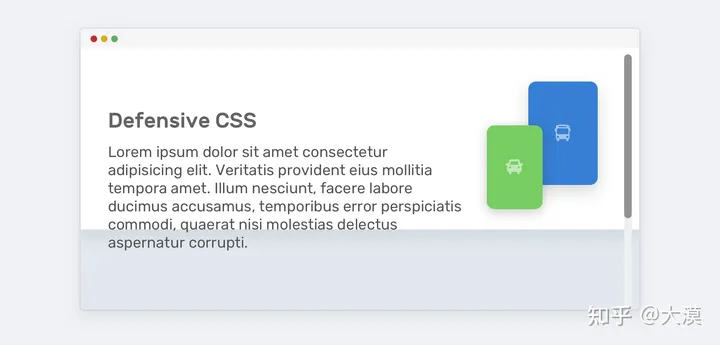
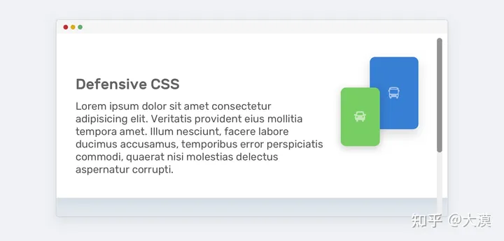
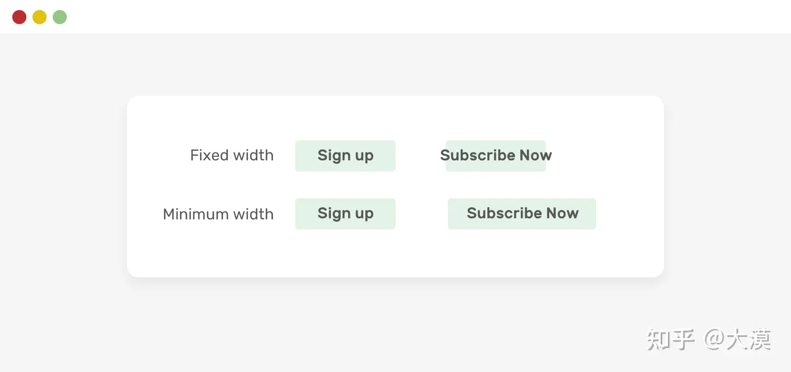
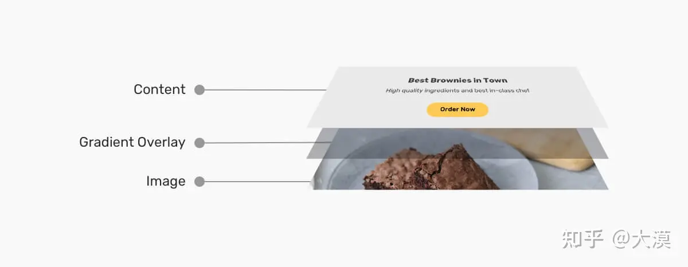
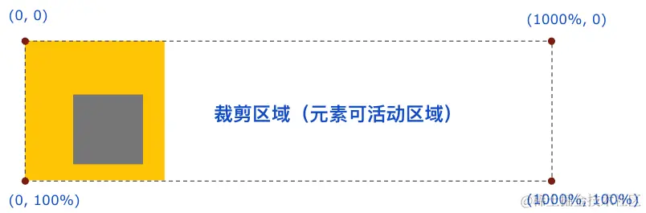

# 样式技巧

## 阻止 `input` 聚焦

使用 `@mousedown.prevent` 阻止默认事件

```html
<el-input type="text"/>
<el-button type="primary" @mousedown.prevent>点击</el-button>
```

## 设置优先级

importance = "high" 如果是 js 文件使用 preload

```html

```

也可以使用 [fetchpriority](https://developer.mozilla.org/en-US/docs/Web/API/HTMLImageElement/fetchPriority) 有效值 有 high low auto

fetchpriority 属性可以与 link、script、img 以及 iframe 标签一起使用，该属性允许我们在使用这些标签加载资源（例如：样式资源、字体资源、脚本资源、图像资源和 iframe）时指定优先级。

## min-width / min-height 代替 width / height



为了避免内容超出容器，我们需要使用 min-height 来替代 height：

```css
.hero {
    min-height: 350px;
}
```



使用 width 如果文本过长会溢出  把 width 换成 min-width 就不会出现这种现象了：

```css
.button {
  min-width: 100px;
}
```

## 图片上的文字

> 很多场景中，文字会出现在图片之上:  
> 大多数的时候，开发者都会考虑在文本和图片之间增一个层，这个层可能是一个纯色层，也能是一渐变层，也可能是一个带有一定透明度的层，为增加文本的可读性



<style scoped lang="scss" module="textOnPicContainer">

.textOnPicContainer {
  min-height: 100vh;
  background-color: #557;
  padding: 20px;
  display: grid;
  place-content: center;
  gap: 20px;
  grid-template-columns: repeat(auto-fill, minmax(300px, 1fr));

  .card {
        background-color: #fff;
        border-radius: 5px;
        border: 1px solid #e8e0e0;
        box-shadow: 0 3px 10px 0 rgb(0 0 0 / 0.3);
        padding: 5px;
        display: grid;
      img {
        max-width: 100%;
        aspect-ratio: 4 / 3;
        object-fit: cover;
        object-position: center;
        border-radius: 5px;
        vertical-align: top;
      }

     &__content{
        color: #fff;
        display: flex;
        flex-direction: column;
        justify-content: flex-end;
        padding: 10px;
        background-image: linear-gradient(to top, rgb(0 0 0 / 0.4), rgb(0 0 0 / 0));
        text-shadow: 0 2px 3px rgba(0, 0, 0, 0.3);
        border-radius: 5px;
     }
     &__thumb, 
     &__content,
     &__tag{
      grid-area: 1 / -1;
     }

    &__tag{
      background-color: #2196f3;
      color: #fff;
      padding: 10px 15px;
    }

    &__content{
      z-index: 2;
    }

    &__tag{
      align-self: start;
      justify-self: start;
      z-index: 3;
      margin-top: 2rem;
      border-radius: 0 10rem 10rem 0;
    }
  }

.card:nth-child(1) .card__content {
  background-image: linear-gradient(to top, rgb(0 0 0 / 0.4), rgb(0 0 0 / 0));
}

.card:nth-child(2) .card__content {
  background-image: linear-gradient(to top, rgb(0 0 0 / 0.4), rgb(0 0 0 / 0));
  background-size: 100% 42.5%;
  background-position: left bottom;
  background-repeat: no-repeat;
}

.card:nth-child(3) .card__content {
  background-image: linear-gradient(
    to top,
    hsla(0, 0%, 0%, 0.62) 0%,
    hsla(0, 0%, 0%, 0.614) 7.5%,
    hsla(0, 0%, 0%, 0.596) 13.5%,
    hsla(0, 0%, 0%, 0.569) 18.2%,
    hsla(0, 0%, 0%, 0.533) 22%,
    hsla(0, 0%, 0%, 0.49) 25.3%,
    hsla(0, 0%, 0%, 0.441) 28.3%,
    hsla(0, 0%, 0%, 0.388) 31.4%,
    hsla(0, 0%, 0%, 0.333) 35%,
    hsla(0, 0%, 0%, 0.277) 39.3%,
    hsla(0, 0%, 0%, 0.221) 44.7%,
    hsla(0, 0%, 0%, 0.167) 51.6%,
    hsla(0, 0%, 0%, 0.117) 60.2%,
    hsla(0, 0%, 0%, 0.071) 70.9%,
    hsla(0, 0%, 0%, 0.032) 84.1%,
    hsla(0, 0%, 0%, 0) 100%
  );
}

.card:nth-child(4)::after {
  content: "";
  grid-area: 1 / -1;
  opacity: 0.5;
  background-image: conic-gradient(
    from 90deg at 40% -25%,
    #ffd700,
    #f79d03,
    #ee6907,
    #e6390a,
    #de0d0d,
    #d61039,
    #cf1261,
    #c71585,
    #cf1261,
    #d61039,
    #de0d0d,
    #ee6907,
    #f79d03,
    #ffd700,
    #ffd700,
    #ffd700
  );
}

.card:nth-child(5) .card__content {
  background-image: linear-gradient(
    to right,
    hsl(0, 0%, 0%) 0%,
    hsla(0, 0%, 0%, 0.964) 7.4%,
    hsla(0, 0%, 0%, 0.918) 15.3%,
    hsla(0, 0%, 0%, 0.862) 23.4%,
    hsla(0, 0%, 0%, 0.799) 31.6%,
    hsla(0, 0%, 0%, 0.73) 39.9%,
    hsla(0, 0%, 0%, 0.655) 48.2%,
    hsla(0, 0%, 0%, 0.577) 56.2%,
    hsla(0, 0%, 0%, 0.497) 64%,
    hsla(0, 0%, 0%, 0.417) 71.3%,
    hsla(0, 0%, 0%, 0.337) 78.1%,
    hsla(0, 0%, 0%, 0.259) 84.2%,
    hsla(0, 0%, 0%, 0.186) 89.6%,
    hsla(0, 0%, 0%, 0.117) 94.1%,
    hsla(0, 0%, 0%, 0.054) 97.6%,
    hsla(0, 0%, 0%, 0) 100%
  );
}

.card:nth-child(6) .card__content {
  background-image: radial-gradient(
    ellipse 100% 100% at right center,
    transparent 80%,
    #000
  );
}

.card:nth-child(7) .card__content {
  background-color: rgb(0 0 0 / 0.6);
}

.card:nth-child(8) .card__content {
  background-color: rgba(0, 0, 0, 0.4);
  background-image: linear-gradient(
    to top,
    rgba(0, 0, 0, 0.8),
    rgba(0, 0, 0, 0) 60%,
    rgba(0, 0, 0, 0.8) 100%
  );
}
  .card:nth-child(9)::before {
    content: "";
    grid-area: 1 / -1;
    background-color: #000;
    z-index: -1;
  }
  .card:nth-child(9) .card__thumb {
    opacity: 0.5;
  }

  .card:nth-child(10) .card__content {
    background-color: rgba(255, 255, 255, 0.06);
    backdrop-filter: blur(5px);
  }

  .card:nth-child(11) .card__thumb {
    filter: grayscale(1);
  }
}
</style>

<div :class="textOnPicContainer.textOnPicContainer">
  <div :class="textOnPicContainer.card">
    <div :class="textOnPicContainer.card__tag">
      Must Try
    </div>
    <div :class="textOnPicContainer.card__content">
      <h2>Card Title</h2>
      <p>Some des will go here and I need it to wrap into lines</p>
    </div>
    <div :class="textOnPicContainer.card__thumb">
      
    </div>
  </div>

  <div :class="textOnPicContainer.card">
    <div :class="textOnPicContainer.card__tag">
      Must Try
    </div>
    <div :class="textOnPicContainer.card__content">
      <h2>Card Title</h2>
      <p>Some des will go here and I need it to wrap into lines</p>
    </div>
    <div :class="textOnPicContainer.card__thumb">
      
    </div>
  </div>

  <div :class="textOnPicContainer.card">
    <div :class="textOnPicContainer.card__tag">
      Must Try
    </div>
    <div :class="textOnPicContainer.card__content">
      <h2>Card Title</h2>
      <p>Some des will go here and I need it to wrap into lines</p>
    </div>
    <div :class="textOnPicContainer.card__thumb">
      
    </div>
  </div>

  <div :class="textOnPicContainer.card">
    <div :class="textOnPicContainer.card__tag">
      Must Try
    </div>
    <div :class="textOnPicContainer.card__content">
      <h2>Card Title</h2>
      <p>Some des will go here and I need it to wrap into lines</p>
    </div>
    <div :class="textOnPicContainer.card__thumb">
      
    </div>
  </div>

  <div :class="textOnPicContainer.card">
    <div :class="textOnPicContainer.card__tag">
      Must Try
    </div>
    <div :class="textOnPicContainer.card__content">
      <h2>Card Title</h2>
      <p>Some des will go here and I need it to wrap into lines</p>
    </div>
    <div :class="textOnPicContainer.card__thumb">
      
    </div>
  </div>

  <div :class="textOnPicContainer.card">
    <div :class="textOnPicContainer.card__tag">
      Must Try
    </div>
    <div :class="textOnPicContainer.card__content">
      <h2>Card Title</h2>
      <p>Some des will go here and I need it to wrap into lines</p>
    </div>
    <div :class="textOnPicContainer.card__thumb">
      
    </div>
  </div>

  <div :class="textOnPicContainer.card">
    <div :class="textOnPicContainer.card__tag">
      Must Try
    </div>
    <div :class="textOnPicContainer.card__content">
      <h2>Card Title</h2>
      <p>Some des will go here and I need it to wrap into lines</p>
    </div>
    <div :class="textOnPicContainer.card__thumb">
      
    </div>
  </div>

  <div :class="textOnPicContainer.card">
    <div :class="textOnPicContainer.card__tag">
      Must Try
    </div>
    <div :class="textOnPicContainer.card__content">
      <h2>Card Title</h2>
      <p>Some des will go here and I need it to wrap into lines</p>
    </div>
    <div :class="textOnPicContainer.card__thumb">
      
    </div>
  </div>

  <div :class="textOnPicContainer.card">
    <div :class="textOnPicContainer.card__tag">
      Must Try
    </div>
    <div :class="textOnPicContainer.card__content">
      <h2>Card Title</h2>
      <p>Some des will go here and I need it to wrap into lines</p>
    </div>
    <div :class="textOnPicContainer.card__thumb">
      
    </div>
  </div>
  <div :class="textOnPicContainer.card">
    <div :class="textOnPicContainer.card__tag">
      Must Try
    </div>
    <div :class="textOnPicContainer.card__content">
      <h2>Card Title</h2>
      <p>Some des will go here and I need it to wrap into lines</p>
    </div>
    <div :class="textOnPicContainer.card__thumb">
      
    </div>
  </div>

  <div :class="textOnPicContainer.card">
    <div :class="textOnPicContainer.card__tag">
      Must Try
    </div>
    <div :class="textOnPicContainer.card__content">
      <h2>Card Title</h2>
      <p>Some des will go here and I need it to wrap into lines</p>
    </div>
    <div :class="textOnPicContainer.card__thumb">
      
    </div>
  </div>
  <div :class="textOnPicContainer.card">
    <div :class="textOnPicContainer.card__tag">
      Must Try
    </div>
    <div :class="textOnPicContainer.card__content">
      <h2>Card Title</h2>
      <p>Some des will go here and I need it to wrap into lines</p>
    </div>
    <div :class="textOnPicContainer.card__thumb">
      
    </div>
  </div>
</div>

## background

### 渐变

:::tip 
  **渐变本质是一个图片,可以实现图片的效果** 
:::

### background-clip

#### padding-box / border-box


实现一个红黄相间的边框  
1. 利用 border-style: dashed 设置一个虚线边框；
2. 利用 background-clip: border-box 让背景色从边框处开始绘制；
3. 再设置第二重背景色，利用 background-clip: padding-box 让这重背景色从 padding 处开始即可。

```css
div {
    width: 100px;
    height: 100px;
    background: linear-gradient(#fff, #fff), #e91e63;
    background-clip: padding-box, border-box;
    border: 5px dashed #ffeb3b;
}
```

<div id="backgoundClip"></div>

<style>
#backgoundClip{
    width: 100px;
    height: 100px;
    margin:0 auto;
    background: linear-gradient(#fff, #fff), #e91e63;
    background-clip: padding-box, border-box;
    border: 5px dashed #ffeb3b;
}
</style>

**技巧点在于使用 `padding-box` 填充 `linear-gradient` 因为 backgound 只可以使用一种颜色,但是 `linear-gradient` 是一个图片**

#### background-clip: text

以区块内的文字作为裁剪区域向外裁剪，文字的背景即为区块的背景，文字之外的区域都将被裁剪掉

```css
div {
  color: transparent;
  background-clip: text;
}
```

但是 `linear-gradient` 也算是背景图片

```css
div {
    font-size: 54px;
    color: transparent;
    background: linear-gradient(45deg, #ffeb3b, #009688, yellowgreen, pink, #03a9f4, #9c27b0, #8bc34a); // [!code fl]
    background-clip: text;
}
```

<div id="backgoundText"> background-clip: text</div>

<style>
#backgoundText{
    font-size: 54px;
    line-height:54px;
    color: transparent;
    background: linear-gradient(45deg, #ffeb3b, #009688, yellowgreen, pink, #03a9f4, #9c27b0, #8bc34a);
    background-clip: text;
}
</style>

### background 与 display: inline

那就是 background 在 display: inline 和 display: block 下的不同表现。

```html
<style>
p, a {
  background: linear-gradient(90deg, blue, green);
}
</style>
<p>Lorem .....</p>
<a>Lorem .....</a>
```


加上动画

```css
p, a {
    color: #000;
    background: linear-gradient(90deg, blue, green);
    background-size: 100% 100%;
    background-repeat: no-repeat;
    transition: all 1s linear;
}

p:hover ,
a:hover {
    background-size: 0 100%;
}
```


#### 多行文本的渐隐消失

```html
<p>
  <a>Mollitia nostrum placeat consequatur deserunt velit ducimus possimus commodi temporibus debitis quam
  </a>
</p>
```

```scss
p {
    position: relative;
    width: 400px;
}
a {
    background: linear-gradient(90deg, transparent, transparent 70%, #fff);
    background-repeat: no-repeat;
    cursor: pointer;
    color: transparent;

    &::before {
        content: "Mollitia nostrum placeat consequatur deserunt velit ducimus possimus commodi temporibus debitis quam";
        position: absolute;
        top: 0;
        left: 0;
        color: #000;
        z-index: -1;
    }
}
```

<style lang="scss" module="backgroundDisplay" scoped>
.p {
    position: relative;
    width: 400px;
}
.a {
    background: linear-gradient(90deg, transparent, transparent 70%, #fff);
    background-repeat: no-repeat;
    color: transparent;
    
    &::before {
        content: "Mollitia nostrum placeat consequatur deserunt velit ducimus possimus commodi temporibus debitis quamMollitia nostrum placeat consequatur deserunt velit ducimus possimus commodi temporibus debitis quamMollitia nost 456478";
        position: absolute;
        top: 0;
        left: 0;
        color: #000;
        z-index: -1;
    }
}
 </style>

<p :class="backgroundDisplay.p">
  <a :class="backgroundDisplay.a">
  Mollitia nostrum placeat consequatur deserunt velit ducimus possimus commodi temporibus debitis quamMollitia nostrum placeat consequatur deserunt velit ducimus possimus commodi temporibus debitis quamMollitia nost 456478
  </a>
</p>

#### 文字 hover 动效

```html
<p>Lorem ipsum dolor sit amet consectetur adipisicing elit. <a>Mollitia nostrum placeat consequatur deserunt velit ducimus possimus commodi temporibus debitis quam</a>, molestiae laboriosam sit repellendus sed sapiente quidem quod accusantium vero.</p>
```
```css
a {
    background: linear-gradient(90deg, #ff3c41, #fc0, #0ebeff);
    background-size: 0 3px;
    background-repeat: no-repeat;
    background-position: 0 100%;
    transition: 1s all;
    color: #0cc;
}
a:hover {
    background-size: 100% 3px;
    color: #000;
}
```

我们虽然设定了 background: linear-gradient(90deg, #ff3c41, #fc0, #0ebeff)，但是一开始默认它的 **background-size: 0 3px, 也就是一开始是看不到下划线的**，当 hover 的时候，改变 **background-size: 100% 3px**，这个时候，就会有一个 0 3px 到 100% 3px 的变换，也就是一个从无到有的伸展效果

<style module="backgroundHover" scoped>
.a {
    background: linear-gradient(90deg, #ff3c41, #fc0, #0ebeff);
    background-size: 0 3px;
    background-repeat: no-repeat;
    background-position: 0 100%;
    transition: 1s all;
    line-height: 40px;
    color: #0cc;
    cursor:pointer;
}
.a:hover {
    background-size: 100% 3px;
    color: #000;
}
</style>  

<p :class="backgroundHover.p">
 <a :class="backgroundHover.a">Mollitia nostrum placeat consequatur deserunt velit ducimus possimus commodi temporibus debitis quam</a>, molestiae laboriosam sit repellendus sed sapiente quidem quod accusantium vero.</p>

 ### background-attachment
 scroll 与 fixed，一个是相对元素本身固定，一个是相对视口固定，有点类似 position 定位的 absolute 和 fixed


#### 视差滚动

<style lang="scss" scoped module="attachment">
$height:300px;
.section {
    height: $height;
    background: rgba(0, 0, 0, .7);
    color: #fff;
    line-height: $height;
    text-align: center;
    font-size: 20px;
    box-sizing: border-box;
    overflow:scroll
}

.gImg1 {
    background-image: url(https://picsum.photos/1200/1000?random=1);
    background-attachment: fixed;
    background-size: cover;
    background-position: center center;
     height: $height;
}

.gImg2 {
    background-image: url('https://picsum.photos/1200/1000?random=5');
    background-attachment: fixed;
    background-size: cover;
    background-position: center center;
     height: $height;
}

.gImg3 {
    background-image: url('https://picsum.photos/1200/1000?random=10');
    background-attachment: fixed;
    background-size: cover;
    background-position: center center;
     height: $height;
}
</style>
<div :class="attachment.section">
  <section :class="attachment.gImg1">区域1</section>
  <section :class="attachment.gImg2">区域2</section>
  <section :class="attachment.gImg3">区域3</section>
</div>

#### 滚动阴影
结合 srcoll 与 local，实现一种伪滚动阴影


**初始没有滚动的时候是没有阴影展现的，只有当开始滚动，阴影才会出现。**

:::tip
在滚动初始的时候，利用两层背景叠加在一起隐藏阴影背景，真正滚动的时候，将叠加的部分移走，只漏出阴影部分即可 

在开始的时候,使用 `attachment:locale` 挡下阴影部分，在滚动的时候，`attachment:locale` 会自己移开,使用 `attachment:scroll`暴露出阴影
:::
<style scoped module="scrollFixed" lang="scss">
.container {
    width: 100%;
    display: flex;
    justify-content: space-around;
    ul {
      position: relative;
      margin: auto;
      overflow: auto;
      height: 8em;
      padding: .3em .5em;
      border: 1px solid silver;
      li {
          line-height: 24px;
      }
    }
}

.final {
    background: 
        linear-gradient(#fff, transparent 100%),
        linear-gradient(rgba(0, 0, 0, .5), transparent 100%);
    background-size: 100% 50px, 100% 10px;
    background-repeat: no-repeat;
    background-attachment: local, scroll;
}
</style>  


<div :class="scrollFixed.container">
  <ul :class="scrollFixed.final">
          <li>AAAAAAAA AAAA</li>
          <li>BBBBBBBB CCCC</li>
          <li>DDDDDDDD DDDD</li>
          <li>AAAAAAAA AAAA</li>
          <li>BBBBBBBB CCCC</li>
          <li>DDDDDDDD DDDD</li>
          <li>AAAAAAAA AAAA</li>
          <li>BBBBBBBB CCCC</li>
          <li>DDDDDDDD DDDD</li>
          <li>AAAAAAAA AAAA</li>
          <li>BBBBBBBB CCCC</li>
          <li>DDDDDDDD DDDD</li>
  </ul>
</div>

## clip-path
该属性使用裁剪方式创建元素的可显示区域。区域内的部分显示，区域外的隐藏。

### 语法
```css
.div{

  clip-path: url(resources.svg#c1);

  clip-path: inset(100px 50px);

  clip-path: circle(50px at 0 100px);

  clip-path: polygon(50% 0%, 100% 50%, 50% 100%, 0% 50%);

  clip-path: path('M0.5,1 C0.5,1,0,0.7,0,0.3 A0.25,0.25,1,1,1,0.5,0.3 A0.25,0.25,1,1,1,1,0.3 C1,0.7,0.5,1,0.5,1 Z');
}
```
[`clip-path 工具`](https://bennettfeely.com/clippy/)

### clip-path 的局限性

<style scoped module="clipPath">
.div {
    width: 200px;
    height: 100px;
    clip-path: polygon(40% 0%, 40% 20%, 100% 20%, 100% 80%, 40% 80%, 40% 100%, 0% 50%);
    background: #ff5722;
    border: 2px solid #000;
    margin:auto
}
</style> 

<div :class="clipPath.div"></div>

只有图形的最右侧展示了边框。这是因为，clip-path 其实是切割图形，边框其实是作用在原本的整个 div 之上的


使用 `filter: drop-shadow()` 创建阴影

<blue><code>box-shadow</code> 盒阴影的作用是在整个元素的后方创建阴影，而 <code>drop-shadow()</code> 滤镜则是创建一个符合元素本身形状（alpha 通道）的阴影。</blue>

使用多层阴影  

```html
<style>
   .father {
       height: 100px;
       width: 200px;
       margin: auto;
       filter:drop-shadow(0 0 .5px #000)
           drop-shadow(0 0 .5px #000)
           drop-shadow(0 0 .5px #000)
           drop-shadow(0 0 .5px #000)
           drop-shadow(0 0 .5px #000)
           drop-shadow(0 0 .5px #000)
           drop-shadow(0 0 .5px #000);;
   }
   .children {
       height: 100%;
       clip-path: polygon(40% 0%, 40% 20%, 100% 20%, 100% 80%, 40% 80%, 40% 100%, 0% 50%);
       background: #ff5722;
   }
</style>  

<div :class="clipPath.father">
    <div :class="clipPath.children"></div>
</div>
```

<style scoped module="clipPath" >
.father {
    margin: auto;
    height: 100px;
    width: 200px;
    filter:drop-shadow(0 0 .5px #000)
        drop-shadow(0 0 .5px #000)
        drop-shadow(0 0 .5px #000)
        drop-shadow(0 0 .5px #000)
        drop-shadow(0 0 .5px #000)
        drop-shadow(0 0 .5px #000)
        drop-shadow(0 0 .5px #000);;
}
.children {
    height:100%;
    clip-path: polygon(40% 0%, 40% 20%, 100% 20%, 100% 80%, 40% 80%, 40% 100%, 0% 50%);
    background: #ff5722;
}
</style>  

<div :class="clipPath.father">
    <div :class="clipPath.children"></div>
</div>

### 利用 clip-path 实现指定区域的 overflow:hidden
使用 clip-path，可以实现任意方向上的空间裁剪！其控制内容的溢出裁剪的能力比 overflow: hidden 还要强大

```css
div{
    // 只允许右侧可以溢出的容器
    clip-path: polygon(0 0 ,1000% 0, 1000% 100%, 0 100%);

   // 裁剪出左边、上边、右边都 overflow:hidden，下边不 overflow: hidden 的区域
    clip-path: polygon(100% 0，100% 1000%, 0 1000%, 0 0);
}
```


### 基于 clip-path 的边框动画
<blue><code>clip-path</code> 可以设置 <code>border-radius</code></blue>

```css
div {
    position: relative;
}
div::before {
    content: "";
    position: absolute;
    top: 0;
    left: 0;
    right: 0;
    bottom: 0;
    border: 2px solid gold;
    border-radius: 5px; //[!code hl]
    animation: clippath 3s infinite linear; //[!code hl]
}
@keyframes clippath {
    0%,
    100% {
        clip-path: inset(0 0 95% 0);
    }
    25% {
        clip-path: inset(0 95% 0 0);
    }
    50% {
        clip-path: inset(95% 0 0 0);
    }
    75% {
        clip-path: inset(0 0 0 95%);
    }
}

```

<style lang="scss" scoped module="clipPathBorder">

.div {
    position: relative;
    margin: auto;
    width: 160px;
    line-height: 160px;
    text-align: center;
    font-size: 24px;
    
    &::before {
        content: "";
        border-radius: 5px;
        position: absolute;
        top: 0;
        left: 0;
        right: 0;
        bottom: 0;
        border: 2px solid gold;
        transition: all .5s;
        animation: clippath 3s infinite linear;
    }
}

@keyframes clippath {
    0%,
    100% {
        clip-path: inset(0 0 95% 0);
    }
    
    25% {
        clip-path: inset(0 95% 0 0);
    }
    50% {
        clip-path: inset(95% 0 0 0);
    }
    75% {
        clip-path: inset(0 0 0 95%);
    }
}

.bg::before {
    background: rgba(255, 215, 0, .5);
}
</style>  

<div :class="clipPathBorder.div">Hello</div>
<div :class="[clipPathBorder.div,clipPathBorder.bg]">示意图</div>


```html
<style lang="scss" scoped module="clipPathBorder2">
  .div1 {
    position: relative;
    margin: auto;
    width: 120px;
    line-height: 64px;
    text-align: center;
    color: #fff;
    font-size: 20px;
    border: 2px solid gold;
    background: gold;
    transition: all .3s;
    cursor: pointer;
    &::before,
    &::after {
        content: "";
        position: absolute;
        top: -10px;
        left: -10px;
        right: -10px;
        bottom: -10px;
        border: 2px solid gold;
        transition: all .5s;
        animation: clippath 3s infinite linear;
        border-radius: 10px;
    }
    
    &::after {
        animation: clippath 3s infinite -1.5s linear;
    }
}

@keyframes clippath {
    0%,
    100% {
        clip-path: inset(0 0 98% 0);
    }
    
    25% {
        clip-path: inset(0 98% 0 0);
    }
    50% {
        clip-path: inset(98% 0 0 0);
    }
    75% {
        clip-path: inset(0 0 0 98%);
    }
}
</style>  

<div :class="clipPathBorder2.div1">Hello</div>
```


<style lang="scss" scoped module="clipPathBorder2">
  .div1 {
    position: relative;
    margin: auto;
    width: 120px;
    line-height: 64px;
    text-align: center;
    color: #fff;
    font-size: 20px;
    border: 2px solid gold;
    background: gold;
    transition: all .3s;
    cursor: pointer;
    &::before,
    &::after {
        content: "";
        position: absolute;
        top: -10px;
        left: -10px;
        right: -10px;
        bottom: -10px;
        border: 2px solid gold;
        transition: all .5s;
        animation: clippath 3s infinite linear;
        border-radius: 10px;
    }
    
    &::after {
        animation: clippath 3s infinite -1.5s linear;
    }
}

@keyframes clippath {
    0%,
    100% {
        clip-path: inset(0 0 98% 0);
    }
    
    25% {
        clip-path: inset(0 98% 0 0);
    }
    50% {
        clip-path: inset(98% 0 0 0);
    }
    75% {
        clip-path: inset(0 0 0 98%);
    }
}
</style>  

<div :class="clipPathBorder2.div1">Hello</div>

### 基于 clip-path 的动态区域裁剪动画
通过改变 `clip-path` 来动态改变显示区域

```html
<style lang="scss" scoped module="clipPathBorder2">
.container {
    position: relative;
    width: 400px;
    height: 300px;
    margin: auto;
    overflow: hidden;
    cursor: pointer;
    transition: clip-path .3s linear;
    clip-path: circle(20px at 44px 44px); //[!code hl]
    @apply bg-green-300;
    
    &:hover {
        clip-path: circle(460px at 44px 44px);  //[!code hl]
    }
}

ul {
    position: absolute;
    line-height: 32px;
    top:50px;
    padding-left: 50px;
    font-size: 18px;
    list-style: none;
    
    li:hover {
        color: deeppink;
    }
}
</style>  

<div :class="clipPathBorder3.container">
    <ul>
        <li>11111</li>
        <li>22222</li>
        <li>33333</li>
        <li>44444</li>
    </ul>
</div>
```


<style lang="scss" scoped module="clipPathBorder3">
.container {
    position: relative;
    width: 400px;
    height: 300px;
    margin: auto;
    overflow: hidden;
    cursor: pointer;
    transition: clip-path .3s linear;
    clip-path: circle(20px at 44px 44px); //[!code hl]
    @apply bg-green-300;
    
    &:hover {
        clip-path: circle(460px at 44px 44px);  //[!code hl]
    }
}

ul {
    position: absolute;
    line-height: 32px;
    top:50px;
    padding-left: 50px;
    font-size: 18px;
    list-style: none;
    
    li:hover {
        color: deeppink;
    }
}
</style>  

<div :class="clipPathBorder3.container">
    <ul>
        <li>11111</li>
        <li>22222</li>
        <li>33333</li>
        <li>44444</li>
    </ul>
</div>


