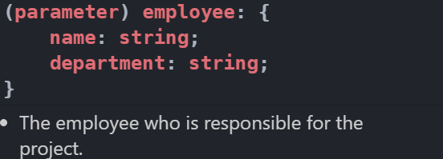
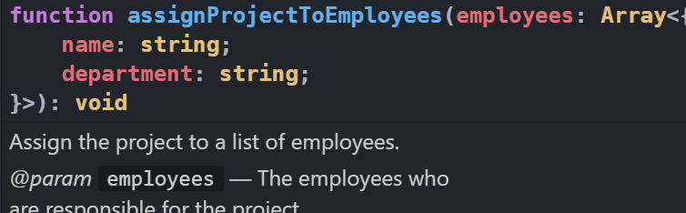
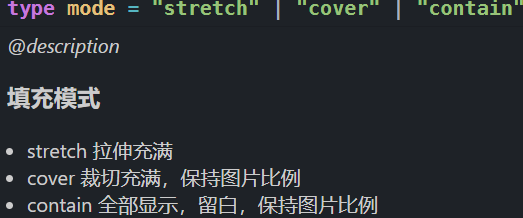

# 代码规范

**怎样写出更加易懂,易于维护代码**

✈️✈️✈️✈️ 用代码讲故事
## 函数
1. 函数的形参数量要少于 3 个,否则可以使用对象形式传递
2. 函数无副作用,不影响外部变量
3. **函数要么做事,要么回答问题**
4. **如果无法精确的起一个函数名的话,说明可以再拆分**
5. 函数要足够单纯,一个函数只做一件事


比如: 添加一个 item
```js
const addItemToCart =(cart,item)=>{
    return [...cart,{item}]
}
```
### 命名
 **命名要偏向于 🔥函数的功能**,而非执行过程  
前缀词 + 名词 + 动词 ( is/can/has/ .... + something + verb )

#### 前缀词
 1. 是否符合状态 -- is
 2. 能否执行 -- can
 3. 是否包含 -- has/include/contains
 4. 是否需要 -- should / need
 5. 过滤 -- filter filterByName
 6. 合并 -- merge mergeConfig
 7. 排序 -- sort  sortByAmount
 8. 转化 -- to toUppderCase / toDollars
 9. 从对象/数据结构中获取数据 -- get getUserId
 10. 计算获取数据 -- cal calUserAveragScore
 11. 分析数据,不能直接获取 -- parse parseUserInfo
 12. 网络请求 --fetch fetchUserInfo
## 变量
### 解释性变量 / 中间变量

一些变量是只在中间使用,但是有实际意义,避免过长的计算过程导致的心智负担

```js
// 总价格为商品总价(单价 * 数量) - 折扣（超过 100 个打 9 折）
let orderInfo = {
	quanity:150,
	price:3.7
}

function getTotalPrice (orderInfo) {
  // 基础金额
	let baseSumMoney = orderInfo.quanity * orderInfo.price;
  // 打折金额
	let discountMoney = Math.max( 0, orderInfo.quanity - 100 ) * orderInfo.price * 0.1;
	return baseSumMoney - discountMoney
}
// 像 baseSumMoney 和 discountMoney  都属于解释型变量
```
 遍历中的解释变量
```js
  fruits.map(fruit=> doSomeing(fruit))
```

## 布尔值
使用 `is/can/check` 前缀词 + 名词 + 形容词/动词  

不一定非得包含这三种,主要目的是说明变量的意义

```js
const isDialogOpen = true
const canPageWrite = true
const hasFruit = true
```
## 数字
一些能够描述数字意义的词语
```js
const minBugs = 1
const maxBugs = 5;
const totalBugs = 3
```
## 代码格式
1. 应该像读报纸,顶部给出高级的算法和概念,细节依次展开  
2. 所有的变量统一写到最上面  
3. 代码组之间添加空白行

```js
(options = arguments[ i ] ) !== null  // 赋值判断一起写，好骚

function Clone() {
  var clone,copy,
      i = 1,
      target = arguments[0] || {},
      length = arguments.length;

  if (typeof target === "boolean") {
    target = arguments[1] || {};
  }

  for (; i < length; i++) {
    if((options = arguments[ i ] ) !== null)
      for (name in options) {
        copy = options[ name ]

        if (typeof copy == "object"){
          clone = {}
          Clone(clone, copy)
        } else {
          target[ name ] = copy;
        }
    }
  }

  return target
}
```
总结: 代码要整洁大气

## vue
PascalCase (单词首字母大写命名)是最通用的**文件声明**约定  
kebab-case (短横线分隔命名) 是最通用的**使用**约定

```js
// 文件命名 
MyComponent.vue

// 组件名应该以高级别的 (通常是一般化描述的) 单词开头，以描述性的修饰词结尾
TodoList.vue
TodoListItem.vue
TodoListItemButton.vue

// 基础组件
// 比如 button 
BaseButton.vue
BaseTable.vue

// 只应该拥有单个活跃实例的组件应该以 The 前缀命名，以示其唯一性
// 比如 官网的 nav 部分 和 footer 部分 或者 后台管理系统的 侧边栏
TheNav.vue 
TheFooter.vue 
TheAside.vue
```


```vue
<template>
  <my-component greeting-text="hi"></my-component>
</template>
<script>
import MyComponent from './MyComponent.vue'
// 可以想象 data-set
props: {
  greetingText: String
}
</script>
```

## JSDOC
### @constant
别名:@const  
@constant 标签指明这个对象是一个常量。

```js
/** @constant
    @type {string}
    @default
*/
const RED = 'FF0000';

/** @constant {number} */
var ONE = 1;
```
### @borrows
@borrows标签允许您将另一个标识符的描述添加到你的当前描述。
```js
/**
 * @namespace
 * @borrows trstr as trim
 */
var util = {
    trim: trstr
};

/**
 * @param {string} str
 */
function trstr(str) {
  return 10
}
```
### @description
别名:@desc
如果在注释开始的地方添加描述，那么可省略@description标签。
```js
  /**
 * Add two numbers.
 * @param {number} a
 * @param {number} b
 * @returns {number}
 */
function add(a, b) {
    return a + b;
}
```

### @example
中间隔一行
```js
/**
* @example
 *
 * var object = { 'a': 1 };
 * var other = { 'a': 1 };
 *
 * _.eq(object, object);
 * // => true
 *
 */
```
### @namespace
 命名空间
```js
/**
 *
 * @namespace MyNamespace.
 */
var MyNamespace = {
  /**
   * A function in MyNamespace (MyNamespace.myFunction).
   * @function foo
   * @param x {string}
   * @memberof MyNamespace
   */
  foo: function (x) {},
  /**
   * @constant
   * @type number
   * @default 1
   */
  bar: 1,
};

MyNamespace.foo;
```
属性
```js
  /**
 * @namespace
 * @property {object}  defaults               - The default values for parties.
 * @property {number}  defaults.players       - The default number of players.
 * @property {string}  defaults.level         - The default level for the party.
 * @property {object}  defaults.treasure      - The default treasure.
 * @property {number}  defaults.treasure.gold - How much gold the party starts with.
 */
var config = {
    defaults: {
        players: 1,
        level:'beginner',
        treasure: {
            gold: 0
        }
    }
};
```

### @param 
你可以在变量说明前加个连字符，使之更加容易阅读
```js
/**
 * @param {string} somebody - Somebody's name.
 */
function sayHello(somebody) {
  alert('Hello ' + somebody);
}
```
#### 普通对象
```js
/**
 * Assign the project to an employee.
 * @param {Object} employee - The employee who is responsible for the project.
 * @param {string} employee.name - The name of the employee.
 * @param {string} employee.department - The employee's department.
 */
function Project  (employee) {
  // ...
}
```


#### 引用其他对象
```js
// 先使用 `typedef`定义 类型
/**
 * @typedef {Object} Student - 一个对象
  // 描述: 记录一个对象的属性。
 * @property {string} name - 一个name
 */

/**
 * @type {Student}
 */
let f = {
  name:12
}
```
悬浮到 `Student` 可以直接看到定义

#### 可选参数
```js
/**
 * @param {string} [somebody] - Somebody's name.
 */
function sayHello(somebody) {
    if (!somebody) {
        somebody = 'John Doe';
    }
    alert('Hello ' + somebody);
}
```
#### 默认参数
```js
  /**
 * @param {string} [somebody=John Doe] - Somebody's name.
 */
function sayHello(somebody) {
    if (!somebody) {
        somebody = 'John Doe';
    }
    alert('Hello ' + somebody);
}
```

#### 多种类型
```js
  /**
 * @param {(string|string[])} [somebody=John Doe] - Somebody's name, or an
 */
function sayHello(somebody) {
    if (!somebody) {
        somebody = 'John Doe';
    } else if (Array.isArray(somebody)) {
        somebody = somebody.join(', ');
    }
    alert('Hello ' + somebody);
}
```

#### 数组对象
```js
/**
 * Assign the project to a list of employees.
 * @param {Array.<{ name: string, department: string }>} employees - The employees
 */
function assignProjectToEmployees(employees) {
  // ...
}
```


### @callback
```js
/**
 * This callback type is called `requestCallback` and is displayed as a global symbol.
 *
 * @callback requestCallback
 * @param {number} responseCode
 * @param {string} responseMessage
 */

/**
 * Does something asynchronously and executes the callback on completion.
 * @param {requestCallback} cb - The callback that handles the response.
 */
function doSomethingAsynchronously(cb) {
  // code
};
```
### @type

```js

/**@type {string}*/

var s;
/**@type {PromiseLike<string>} */
var promisedString;
// You can specify an HTML Element with DOM properties
/** @type {HTMLElement} */
var myElement = document.querySelector(selector);

@type {string | boolean}
@type {number[]} 
@type {Array<number>} 

// 指定对象字面量
@type {{ a: string, b: number }}
@type {Object<string, number>}

@type {function(string, boolean): number}
@type {(s: string, b: boolean) => number} Typescript syntax 
@type {Function} 
var sbn;
```

### ts中可以使用
```ts
/**
*
@description ### 填充模式
- stretch 拉伸充满
- cover 裁切充满，保持图片比例
- contain 全部显示，留白，保持图片比例 */ 
type mode = "stretch" | "cover" | "contain";
```

