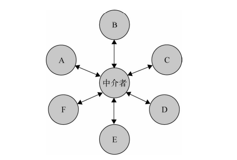
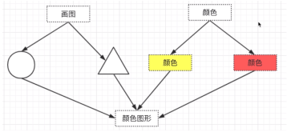

# 设计模式

## 设计原则

1. S--单一职责原则 Single Responsibility Principle  
   **一个程序只做一件事 过于复杂就拆分开,每个部分保持独立**
      Car 和 Trip 要分开,提取公共信息,以后修改只会修改 car 或者 trip,不会相互关联

```js
  // 有快车 和 专车  快车 1元 专车 2元 一共5公里
  // 行程开始 需要提示车牌号 行程结束后显示结束价格
  class Car {
    constructor(name,number){
      this.name = name
      this.number = number
    }
  }

  class KuaiChe extends Car {
    constructor(name,number){
      super(name,number)
      this.price = 1
    }
  }

  class ZhuanChe extends Car {
    constructor(name,number){
      super(name,number)
      this.price = 1
    }
  }

  class Trip {
    constructor(car){
      this.car = car
    }
    start(){
      console.log(this.car.name,this.car.number);
    }
    end(){
      console.log(this.car.price * 5);
    }
  }

  const car = new KuaiChe('奔驰',100)
  let trip = new Trip(car)
  trip.start()
  trip.end()
```
2. O--开闭原则 Open Closed Principle  
   **对扩展开放,对修改封闭**(可以扩展,但是不能修改原来的,要不还得重新测试)增加需求时,扩展新代码,而非修改已有代码

   1. 减少测试成本
   2. 如果多人开发,会影响其他人

3. L-- 里氏替换原则 Liskov Substitution Principle      
    子类覆盖父类 父类能出现的地方子类就能出现,**与期望行为一致的替换**  
    俗话说,老鼠生的会打洞,就是符合里式替换原则。   
    如果老鼠生的不会打洞,会上天,就违背了该原则  
    ```java
    class CustomList<T> extends ArrayList<T> {
      @Override
      public T get(int index) {
          throw new UnsupportedOperationException();
      } 
    }
    ```
    仅重写get方法,throw一个UnsupportedOperationException,因为List接口关于get方法的描述,仅会抛出IndexOutOfBoundsException, throw UnsupportedOperationException的行为并不是基类所期望的,即违反了里氏替换原则

4. D -- 依赖倒置原则 Dependence Inversion Principle  
    只关注接口不关注具体实现
```ts
// 只依赖于 girlFriend 这个接口
  interface  girlFriend {
    name:string,
    age:number
  }

  class Coco implements girlFriend {
    name='zs';
    age=12
  }

  class Coco2 implements girlFriend {
    name='lsii';
    age=12
  }

  // 如果不是的话,就要 在 SingleDog 中 实现 girlFriend
  class  SingleDog {
    constructor(public pro:girlFriend){
      console.log(pro.age);
    }
  }

  var s1 = new SingleDog(new Coco)
```

5. 接口独立原则 Interface Segregation Principle 

```ts
  interface  Student {
    name:string,
    age:number,
    schoolName:string
  }

  let s:Student = {
    name:'zs',
    age:12,
    schoolName:'小学'
  }

  // 这个地方应该再创建一个 新的接口
  let p:Partial<Student> = {
    name:'tang',
    age:26
  }

  let p:Omit<Student,'schoolName'>= {
    name:'tang',
    age:26
  }

  // 把 schoolName 变成可选的
  interface Student {
    name:string,
    age:number,
    schoolName:string
  }

  type C<T,K extends keyof T> = Pick<T,Exclude<keyof T,K>> & Partial<T>

  type D = C<Student,"schoolName">

  type CalType<T> = {
    [K in keyof T]:T[K]
  }

  type F = CalType<D>

  let s:CalType<D> = {
    name:'',
    age:20,
    schoolName:''
  }
```

## 对象三要素

### 封装
 
#### 封装数据

在许多语言的对象系统中,封装数据是由语法解析来实现的,这些语言也许提供了 **private、 public、protected** 等关键字来提供不同的访问权限

**JavaScript 依赖变量的作用域来实现封装特性**

```js
  var myObject = (function(){
    var __name = 'sven'; // 私有（private）变量
    return {
      getName: function(){ // 公开（public）方法
        return __name;
      }
    }
  })();

  console.log( myObject.getName() ); // 输出：sven
  console.log( myObject.__name ) // 输出：undefined
```

#### 封装实现

对象对它自己的行为负责。其他对象或者用户都不关心它的内部实现。封装使得对象之间的耦合变松散

**对象之间只通过暴露的 API 接口来通信**。当我们修改一个对象时,可以随意地修改它的内部实现,只要对外的接口没有变化,就不会影响到程序的其他功能

拿迭代器来说明,我们编写了一个 each 函数,它的作用就是遍历一个聚合对象,使用这个 each 函数的人不用关心它的内部是怎样实现的,只要它提供的功能正确便可以。即使 each 函数修改了内部源代码,只要对外的接口或者调用方式没有变化,用户就不用关心它内部实现的改变

#### 封装变化

找到变化并封装之 ===> 创建型模式、结构型模式和行为型模式

**通过封装变化的方式,把系统中稳定不变的部分和容易变化的部分隔离开来**  

在系统的演变过程中, 我们只需要**替换那些容易变化**的部分,如果这些部分是已经封装好的,替换起来也相对容易。这可以最大程度地保证程序的稳定性和可扩展性。

### 多态

**同一操作作用于不同的对象上面,可以产生不同的解释和不同的执行结果**

```js
 var makeSound = function( animal ){
	if ( animal instanceof Duck ){
		console.log( '嘎嘎嘎' );
	}else if ( animal instanceof Chicken ){
		console.log( '咯咯咯' );
	}
};

var Duck = function(){};
var Chicken = function(){};
makeSound( new Duck() ); // 嘎嘎嘎
makeSound( new Chicken() );
```

多态背后的思想是将 `"做什么"` 和 `"谁去做以及怎样去做"` 分离开来,也就是将 `"不变的事物"` 与 `"可能改变的事物"` 分离开来。

在这个故事中,动物都会叫,这是不变的,但是不同类 型的动物具体怎么叫是可变的。把不变的部分隔离出来,把可变的部分封装起来

首先我们把不变的部分隔离出来,那就是所有的动物都会发出叫声

```js
  var makeSound = function( animal ){
    animal.sound();
  };
```

把可变的部分各自封装起来,我们刚才谈到的多态性实际上指的是对象的多态性

```js
  var Duck = function(){}

  Duck.prototype.sound = function(){
    console.log( '嘎嘎嘎' );
  };

  var Chicken = function(){}

  Chicken.prototype.sound = function(){
    console.log( '咯咯咯' );
  };
  makeSound( new Duck() ); // 嘎嘎嘎
  makeSound( new Chicken() ); // 咯咯咯
```

多态最根本的作用就是通过把过程化的 ***条件分支语句转化为对象的多态性***,从而消除这些条件分支语句

条件语句就是上文说的 ifelse 判断是不是 animal instanceof Duck,对象的多态性就是声明不同的对象在对象身上绑定方法 将 ***行为分布在各个对象中,并让这些对象各自负责自己的行为*** 


```js
  var googleMap = {
    show: function(){
      console.log( '开始渲染谷歌地图' );
    }
  };

  var renderMap = function(){
    googleMap.show();
  };
  renderMap(); // 输出：开始渲染谷歌地图
```

后来因为某些原因,要把谷歌地图换成百度地图,为了让 renderMap 函数保持一定的弹性, 我们用一些条件分支来让 renderMap 函数同时支持谷歌地图和百度地图

```js
var googleMap = {
  show: function(){
    console.log( '开始渲染谷歌地图' );
  }
};

var baiduMap = {
  show: function(){
    console.log( '开始渲染百度地图' );
  }
};

var renderMap = function( type ){
  if ( type === 'google' ){
    googleMap.show();
  } else if ( type === 'baidu' ){
    baiduMap.show();
  }
};

renderMap( 'google' ); // 输出：开始渲染谷歌地图
renderMap( 'baidu' ); // 输出：开始渲染百度地图
```

抽离出来

```js
  var renderMap = function( map ){
	if ( map.show instanceof Function ){
		map.show();
	}
};

renderMap( googleMap ); // 输出：开始渲染谷歌地图
renderMap( baiduMap ); // 输出：开始渲染百度地图
```

"做什么"和"怎么去做"是可以分开的,怎么去做绑定在了自己的身上,以后只需变化自己内部结构即可,只要对外暴露出来的api不变  
即使以后增加了搜搜地图,renderMap 函数仍然不需要做任何改变

```js
var sosoMap = {
  show: function(){
    console.log( '开始渲染搜搜地图' );
  }
};
renderMap( sosoMap ); // 输出：开始渲染搜搜地图
```

把条件语句抽离出来,使用对象的多态, ***让对象自己负责自己的行为,同样的操作不同的效果***

## 工厂模式

需要大量创建某个对象的时候,通过调用工厂方法,来创建相似的类,不用我们具体创建

当你使用 new 的时候,就应该考虑到 使用 工厂模式


```js

window.$ = function(selector){
	return new JQuery(selector)
}

class Jquery {
	constructor(selector){
		this.selector = selector;
	}
	append(){}
	add(){}
}
```

## 原型链模式


```js
  var Plane = function(){
    this.blood = 100;
    this.attackLevel = 1;
    this.defenseLevel = 1;
  };

  var plane = new Plane();
  plane.blood = 500;
  plane.attackLevel = 10;
  plane.defenseLevel = 7;
  var clonePlane = Object.create( plane );
  console.log( clonePlane );
```

## 🚩 策略模式

策略模式指的是定义一系列的算法，把它们一个个封装起来,就是把 **逻辑和具体分支部分要做的事情分开**


```js
// 策略类
var strategies = {
	"S": function( salary ){
		return salary * 4;
	},
	"A": function( salary ){
		return salary * 3;
	},
	"B": function( salary ){
		return salary * 2;
	}
};
// 环境类 Context  ,把 请求委托给某一个策略类
// 每个策略对象负责的算法已被各自封装在对象内部
var calculateBonus = function( level, salary ){
	return strategies[ level ]( salary );
};

console.log( calculateBonus( 'S', 20000 ) ); // 输出：80000
console.log( calculateBonus( 'A', 10000 ) ); // 输出：30000
```

## 代理模式

代理模式是为一个对象提供 [ *一个代用品或占位符* ],以便控制对它的访问  
***虚拟代理把一些开销很大的对象,延迟到真正需要它的时候才去创建***


### 虚拟代理实现图片预加载

在图片被真正加载好之前,页面中 将出现一张占位的菊花图 loading.gif, 来提示用户图片正在加载

```js
  var myImage = (function(){
    var imgNode = document.createElement( 'img' );
    document.body.appendChild( imgNode );
    return {
      setSrc: function( src ){
        imgNode.src = src;
      }
    }
  })();

var proxyImage = (function(){
	var img = new Image;
	img.onload = function(){
    // 重新赋值
		myImage.setSrc( this.src );
	}
	return {
		setSrc: function( src ){
      // 先设置 gif 动图，因为是本地图片,所以加载速度很快
			myImage.setSrc( 'file:// /C:/Users/svenzeng/Desktop/loading.gif' );
      // 设置真实地址
			img.src = src;
		}
	}
})();
// myImage 和 img.src 同时进行赋值
// myImage 被代理,使用 一个虚拟对象img 进行代理
proxyImage.setSrc( 'http:// imgcache.qq.com/music/photo/k/000GGDys0yA0Nk.jpg' );
```

我们通过 proxyImage 间接地访问 MyImage。proxyImage 控制了客户对 MyImage 的访问,并且在此过程中加入一些额外的操作,比如在真正的图片加载好之前,先把 img 节点的 src 设置为 一张本地的 loading 图片

### 虚拟代理在惰性加载中的应用

miniConsole.js 的代码量大概有 1000 行左右,也许我们并不想一开始就加载这么大的 JS 文件, 因为也许并不是每个用户都需要打印 log。我们希望在有必要的时候才开始加载它,比如当用户 按下 F2 来主动唤出控制台的时候 在 miniConsole.js 加载之前,为了能够让用户正常地使用里面的 API

通常我们的解决方案 是用一个占位的 miniConsole 代理对象来给用户提前使用,这个代理对象提供给用户的接口,跟实际的 miniConsole 是一样的。

用户使用这个代理对象来打印 log 的时候,并不会真正在控制台内打印日志,更不会在页面中创建任何 DOM 节点。即使我们想这样做也无能为力,因为真正的 miniConsole.js 还没有被加载

请求的到底是什么对用户来说是不透明的,用户并不清楚它请求的是代理对象,所以他可以在任何时候放心地使用 miniConsole 对象

```js
// 未加载真正的 miniConsole.js 之前的代码如下：
var cache = [];
var miniConsole = {
	log: function(){
		var args = arguments;
		cache.push( function(){
			return miniConsole.log.apply( miniConsole, args );
		});
	}
};
miniConsole.log(1);
```

当用户按下 F2 时,开始加载真正的 miniConsole.js

```js
  var handler = function( ev ){
    if ( ev.keyCode === 113 ){
      var script = document.createElement( 'script' );
      script.onload = function(){
        for ( var i = 0, fn; fn = cache[ i++ ]; ){
          fn();
        }
      };
      script.src = 'miniConsole.js';
      document.getElementsByTagName( 'head' )[0].appendChild( script );
    }
};
document.body.addEventListener( 'keydown', handler, false );

// miniConsole.js 代码：
miniConsole = {
  log: function(){
    // 真正代码略
    console.log( Array.prototype.join.call( arguments ) );
  }
};
```

这个很有启发,**对于一些需要特定时机才可以执行的方法,可以使用代理**

## ❤️ 发布订阅模式

**主题与观察者分离,不是主动触发,而是被动监听**

> 你坐在 KFC 里,店员要记录( attach )你, 当食物做好了,店员 会通知(notifyObserverAll),然后用户手中的领号牌 会发出声音(update) 用户相当于 订阅者,店员是 发布者


```js
class Subject {
	constructor(){
		this.observers = [];
		this.state = 0
	}
	getState(){
		return this.state
	}
	setState(value){
		this.state = value;
		// 通知观察者们
		this.notifyObserverAll()
	}

	notifyObserverAll(){
		this.observers.forEach(observer=>{
			// 用户手中的铃铛 触发
			observer.update()
		})
	}

	attach(observer){
		this.observers.push(observer)
	}
}

class Observer {
	constructor(name,subject){
		this.name = name
		this.subject = subject
		// 把自己 push 进去 Subject
		this.subject.attach(this)
	}

	update() {
		console.log(`${this.name}${this.subject.getState()}`);
	}
}
// 店员
let s =new Subject()
// 顾客
let o1 = new Observer('o2',s)
// 也可以,这样不过是需要外部调用 attach 方法
let s =new Subject()
let o1 = new Observer('o2')
s.attach(o1)

s.setState(1)
```

### Dom 事件

dom 订阅一个事件,等到有交互发生触发订阅事件

```js
document.body.addEventListener( 'click', function(){
  alert(2)
}, false );
```

```js
  let pubSub = {
  subs: [],
  subscribe(key, fn) { //订阅
    if (!this.subs[key]) {
      this.subs[key] = [];
    }
    this.subs[key].push(fn);
  },

  publish(...arg) {//发布
    let args = arg;
    // 去除发布名称，剩下的都是参数
    let key = args.shift();
    let fns = this.subs[key];

    if (!fns || fns.length <= 0) return;

    for (let i = 0, len = fns.length; i < len; i++) {
      fns[i](args);
    }
  },
  unSubscribe(key) {
    delete this.subs[key]
  }
}

//测试
pubSub.subscribe('name', name => {
  console.log(`your name is ${name}`);
})
pubSub.subscribe('gender', gender => {
  console.log(`your name is ${gender}`);
})
pubSub.publish('name', 'leaf333');  // your name is leaf333
pubSub.publish('gender', '18');  // your gender is 18
```

## 命令模式

我是一个将军,我需要执行操作,但是士兵太多,我把命令给小号手,小号手负责发布命令。小号手执行操作给士兵,士兵去执行

命令模式最常见的应用场景是：**有时候需要向某些对象发送请求,但是并不知道请求的接收者是谁,也不知道被请求的接收者的操作是什么。** 此时希望用一种松耦合的方式来设计程序,使得请求发送者和请求接收者能够消除彼此之间的耦合关系。


### 例子 1

```js
// 小兵,只有操作
class Car {
    start () {
        return '起步'
    }
    turnLeft () {
        return '左转'
    }
    turnRight () {
        return '右转'
    }
    gotStraight () {
        return '直行'
    }
    stop () {
        return '靠边停车'
    }
}

// 类似于 小号手的作用,接受命令,并且进行封装之后 传递给 car
class Command {
    constructor(car) {
        this.car = car
    }
    start () {
        console.log(`${this.car.start()}`)
    }
    left () {
        console.log(`${this.car.turnLeft()}`)
    }
    right () {
        console.log(`${this.car.turnRight()}`)
    }
    straight () {
        console.log(this.car.gotStraight())
    }
    end () {
        console.log(`${this.car.gotStraight()} ${this.car.stop()}`)
    }
    exec (cmd) {
        if (!this[cmd]) return false
        return this[cmd]()
    }
}

// 类似于将军
class Invoker {
    constructor(command) {
        this.command = command
    }
    invoke (cmd) {
        this.command.exec(cmd)
    }
}

const car = new Car()
// 控制小车的命令
const command = new Command(car)

const routes = [
    'start',
    'straight',
    'left',
    'end'
]
const invoker = new Invoker(command)

routes.forEach(route => {
    invoker.invoke(route)
})
```

## 模板方法模式

模板方法模式是一种 , 只需使用继承就可以实现的非常简单的模式。相当于你写好一个模板,跟随模板实现

**模板方法模式由两部分结构组成,第一部分是抽象父类,第二部分是具体的实现子类。**

**通常在抽象父类中封装了子类的算法框架,包括实现一些公共方法以及封装子类中所有方法的执行顺序。 子类通过继承这个抽象类,也继承了整个算法结构,并且可以选择重写父类的方法,子类实现中的相同部分被上移到父类中,而将不同的部分留待子类来实现**


```js
abstract class Beverage {
  init() {
    // 模板方法
    this.boilWater();
    this.brew();
    this.pourInCup();
    this.addCondiments();
  }
  boilWater() {
    console.log("把水煮沸");
  }
  abstract brew();
  abstract pourInCup();
  abstract addCondiments();
}

class Coffee extends Beverage {
  brew(){
    console.log("brew Coffee");
  }
  pourInCup() {

  }
  addCondiments() {

  }
}

class Tea extends Beverage {
  brew(){
    console.log("brew Tea");
  }
  pourInCup() {

  }
  addCondiments() {

  }
}
let c = new Coffee;
c.init()
```

coffe 和 tea 方法都是一样的步骤,都要先把水给煮沸,只是后面的加的料不同  
所以把煮沸水作为一个公共方法,子类重写覆盖

:::tip 
类分为两种,一种为具体类,另一种为抽象类。具体类可以被实例化,抽象类不能被实例化。要了解抽象类不能被实例化的原因,我们可以思考“饮料”这个抽象类

想象这样一个场景：我们口渴了,去便利店想买一瓶饮料,我们不能直接跟店员说：“来一 瓶饮料。”如果我们这样说了,那么店员接下来肯定会问：“要什么饮料？”饮料只是一个抽象名词,只有当我们真正明确了的饮料类型之后,才能得到一杯咖啡、茶、或者可乐

***由于抽象类不能被实例化,如果有人编写了一个抽象类,那么这个抽象类一定是用来被某些具体类继承的***

***抽象类也可以表示一种契约*** 抽象类的主要作用就是为它的子类定义这些公共接口,不能删掉其中一个抽象方法  

比如 模板方法模式 删除一个就不成立了

模板方法模式是一种典型的通过 ***封装变化提高系统扩展性的设计模式*** 子类的方法种类和执行顺序都是不变的,所以我们把这部分逻辑抽象到父类的模板方法里面。而子类的方法具体怎么实现则是可变的,于是我们把这部分变化的逻辑封装到子类中。通过增加新的子类,我们便能给系统增加新的功能,并不需要改动抽象父类以及其他子类,这也是符合开放封闭原则的 
:::

## 职责链模式

> 职责链模式的定义是：使多个对象都有机会处理请求,从而避免请求的发送者和接收者之间的耦合关系,将这些对象连成一条链,并沿着这条链传递该请求,直到有一个对象处理它为止


### 例子 1

负责一个售卖手机的电商网站,经过分别交纳 500 元定金和 200 元定金的两轮预定后（订单已在此时生成）,现在已经到了正式购买的阶段

公司针对支付过定金的用户有一定的优惠政策。  
在正式购买后,已经支付过 500 元定金的用户会收到 100 元的商城优惠券  
200 元定金的用户可以收到 50 元的优惠券  
而之前没有支付定金 的用户只能进入普通购买模式,也就是没有优惠券,且在库存有限的情况下不一定保证能买到

1. orderType：表示订单类型（定金用户或者普通购买用户）,code 的值为 1 的时候是 500 元定金用户,为 2 的时候是 200 元定金用户,为 3 的时候是普通购买用户。
2. pay：表示用户是否已经支付定金,值为 true 或者 false, 虽然用户已经下过 500 元定金的订单,但如果他一直没有支付定金,现在只能降级进入普通购买模式。
3. stock：表示当前用于普通购买的手机库存数量,已经支付过 500 元或者 200 元定金的用户不受此限制。

```js
var order = function( orderType, pay, stock ){
	if ( orderType === 1 ){ // 500 元定金购买模式
		if ( pay === true ){ // 已支付定金
			console.log( '500 元定金预购, 得到 100 优惠券' );
		}else{ // 未支付定金,降级到普通购买模式
			if ( stock > 0 ){ // 用于普通购买的手机还有库存
				console.log( '普通购买, 无优惠券' );
			}else{
				console.log( '手机库存不足' );
			}
		}
	}
	else if ( orderType === 2 ){ // 200 元定金购买模式
		if ( pay === true ){
			console.log( '200 元定金预购, 得到 50 优惠券' );
		}else{
			if ( stock > 0 ){
				console.log( '普通购买, 无优惠券' );
			}else{
				console.log( '手机库存不足' );
			}
		}
	}
	else if ( orderType === 3 ){
		if ( stock > 0 ){
			console.log( '普通购买, 无优惠券' );
		}else{
			console.log( '手机库存不足' );
		}
	}
};
order( 1 , true, 500); // 输出： 500 元定金预购, 得到 100 优惠券
```
很符合直觉,一层一层的执行,但是这样的问题造成了判断条件过多,代码很复杂  
需要抽离出来,抽离出 `order500`,`order200`,`orderNormal`在各自的方法内部判断
#### 职责链重构

```js
var order500 = function( orderType, pay, stock ){
  if ( orderType === 1 && pay === true ){
    console.log( '500 元定金预购, 得到 100 优惠券' );
  }else{
    order200( orderType, pay, stock ); // 将请求传递给 200 元订单
  }
};

// 200 元订单
var order200 = function( orderType, pay, stock ){
  if ( orderType === 2 && pay === true ){
    console.log( '200 元定金预购, 得到 50 优惠券' );
  }else{
    orderNormal( orderType, pay, stock ); // 将请求传递给普通订单
  }
};

// 普通购买订单
var orderNormal = function( orderType, pay, stock ){
  if ( stock > 0 ){
    console.log( '普通购买, 无优惠券' );
  }else{
    console.log( '手机库存不足' );
  }
};

order500( 1 , true, 500); // 输出：500 元定金预购, 得到 100 优惠券
order500( 1, false, 500 ); // 输出：普通购买, 无优惠券
order500( 2, true, 500 ); // 输出：200 元定金预购, 得到 50 优惠券
order500( 3, false, 500 ); // 输出：普通购买, 无优惠券
order500( 3, false, 0 ); // 输出：手机库存不足
```

### 例子 2

```js
// 对于一些流程图非常方便
// 组长
class ZuZhange {
	handle() {
		console.log("ZuZhangeHandle");
	}
}
// 经理
class jingLi {
	handle() {
		console.log("jingLiHandle");
	}
}
// 老板
class laoBan {
	handle() {
		console.log("laoBanHandle");
	}
}

class Action {
	constructor(name, action) {
		this.name = name;
    // 自己的行动
		this.action = action;
    // 下一个流程行为
		this.nextAction = null;
	}
	setNextAction(action) {
		this.nextAction = action;
	}

	handle() {
		// 独一无二的方法
		this.action.handle();
		console.log(`${this.name}handle`);
		// 链条可以一直延续
		this.nextAction?.handle();
	}
}

const a1 = new Action("组长", new ZuZhange());
const a2 = new Action("经理", new jingLi());
const a3 = new Action("老板", new laoBan());
a1.setNextAction(a2);
a2.setNextAction(a3);
a1.handle();
```

解耦了请求发送者和 N 个接收者之间的复杂关系,由于不知道链中的哪个节点可以处理你发出的请求,所以你只需把请求传递给第一个节点即可,而且可以手动指定起始节点 

无论是作用域链、原型链,还是 DOM 节点中的事件冒泡,我们都能从中找到职责链模式的影子

## 中介者模式

中介者模式的作用就是解除对象与对象之间的紧耦合关系。***增加一个中介者对象后,所有的相关对象都通过中介者对象来通信,而不是互相引用***,所以当一个对象发生改变时,只需要通知 中介者对象即可

 
 

### 例子 1

假设我们正在编写一个手机购买的页面,在购买流程中,可以选择手机的颜色以及输入购买数量  
同时页面中有两个展示区域,分别向用户展示刚刚选择好的颜色和数量。

还有一个按钮动态显示下一步的操作  
我们需要查询该颜色手机对应的库存,如果库存数量少于这次的购买数量, 按钮将被禁用并且显示库存不足,反之按钮可以点击并且显示放入购物车     
 


- 下拉选择框 colorSelect
- 文本输入框 numberInput
- 展示颜色信息 colorInfo
- 展示购买数量信息 numberInfo
- 决定下一步操作的按钮 nextBtn

按照一般情况下,因为数量下拉选和颜色下拉选有联动,而且按钮的状态是又与这两个下拉选有关联,所以我们可能会写出如下代码

```html
<body>
  选择颜色: <select id="colorSelect">
    <option value="">请选择</option>
    <option value="red">红色</option>
    <option value="blue">蓝色</option>
  </select>
  输入购买数量: <input type="text" id="numberInput"/>
  您选择了颜色: <div id="colorInfo"></div><br/>
  您输入了数量: <div id="numberInfo"></div><br/>

  <button id="nextBtn" disabled="true">请选择手机颜色和购买数量</button>
  <!--  监听 colorSelect 的 onchange 事件函数和 numberInput 的 oninput 事件函数 -->
  <script>

    var colorSelect = document.getElementById( 'colorSelect' ),
      numberInput = document.getElementById( 'numberInput' ),
      colorInfo = document.getElementById( 'colorInfo' ),
      numberInfo = document.getElementById( 'numberInfo' ),
      nextBtn = document.getElementById( 'nextBtn' );

    var goods = { // 手机库存
      "red": 3,
      "blue": 6
    };
    // 监听 colorSelect 的 onchange 事件函数
    colorSelect.onchange = function(){
      var color = this.value, // 颜色
        number = numberInput.value, // 数量
        stock = goods[ color ]; // 该颜色手机对应的当前库存
      colorInfo.innerHTML = color;

      if ( !color ){
        nextBtn.disabled = true;
        nextBtn.innerHTML = '请选择手机颜色';
        return;
      }

      if ( Number.isInteger ( number - 0 ) && number > 0 ){
        // 用户输入的购买数量是否为正整数
        nextBtn.disabled = true;
        nextBtn.innerHTML = '请输入正确的购买数量';
        return;
      }

      if ( number > stock ){ // 当前选择数量超过库存量
        nextBtn.disabled = true;
        nextBtn.innerHTML = '库存不足';
        return ;
      }

      nextBtn.disabled = false;
      nextBtn.innerHTML = '放入购物车';
    };

    // numberInput 的 oninput 事件函数
    numberInput.oninput = function(){
      var color = colorSelect.value, // 颜色
        number = this.value, // 数量
        stock = goods[ color ]; // 该颜色手机对应的当前库存
      numberInfo.innerHTML = number;

      if ( !color ){
        nextBtn.disabled = true;
        nextBtn.innerHTML = '请选择手机颜色';
        return;
      }

      if ((( number - 0 ) | 0 ) !== number - 0 ){ // 输入购买数量是否为正整数
        nextBtn.disabled = true;
        nextBtn.innerHTML = '请输入正确的购买数量';
        return;
      }
      if ( number > stock ){ // 当前选择数量没有超过库存量
        nextBtn.disabled = true;
        nextBtn.innerHTML = '库存不足';
        return ;
      }
      nextBtn.disabled = false;
      nextBtn.innerHTML = '放入购物车';
    };

  </script>
</body>
```

如果后面再增加内存输入框,还是会要发生变动

#### 中介者模式重构

所有的功能集中到中介者中统一处理

```js
var goods = { // 手机库存
  "red|32G": 3,
  "red|16G": 0,
  "blue|32G": 1,
  "blue|16G": 6
};

// 自执行函数保证数据没有污染
var mediator = (function(){
  var colorSelect = document.getElementById( 'colorSelect' ),
    memorySelect = document.getElementById( 'memorySelect' ),
    numberInput = document.getElementById( 'numberInput' ),
    colorInfo = document.getElementById( 'colorInfo' ),
    memoryInfo = document.getElementById( 'memoryInfo' ),
    numberInfo = document.getElementById( 'numberInfo' ),
    nextBtn = document.getElementById( 'nextBtn' );

  return {
    changed: function( obj ){
      var color = colorSelect.value, // 颜色
        memory = memorySelect.value,// 内存
        number = numberInput.value, // 数量
        stock = goods[ color + '|' + memory ]; // 颜色和内存对应的手机库存数量

      if ( obj === colorSelect ){ // 如果改变的是选择颜色下拉框
        colorInfo.innerHTML = color;
      }else if ( obj === memorySelect ){
        memoryInfo.innerHTML = memory;
      }else if ( obj === numberInput ){
        numberInfo.innerHTML = number;
      }

      if ( !color ){
        nextBtn.disabled = true;
        nextBtn.innerHTML = '请选择手机颜色';
        return;
      }
      if ( !memory ){
        nextBtn.disabled = true;
        nextBtn.innerHTML = '请选择内存大小';
        return;
      }
      if ( Number.isInteger ( number - 0 ) && number > 0 ){ // 输入购买数量是否为正整数
        nextBtn.disabled = true;
        nextBtn.innerHTML = '请输入正确的购买数量';
        return;
      }
      nextBtn.disabled = false;
      nextBtn.innerHTML = '放入购物车';
    }
  }
})();

// 事件函数：
colorSelect.onchange = function(){
  mediator.changed( this );
};
memorySelect.onchange = function(){
  mediator.changed( this );
};
numberInput.oninput = function(){
  mediator.changed( this );
};
```

:::tip 

***中介者模式是迎合迪米特法则的一种实现。迪米特法则也叫最少知识原则,是指一个对象应该尽可能少地了解另外的对象(类似不和陌生人说话),如果对象之间的耦合性太高,一个对象 发生改变之后,难免会影响到其他的对象***


中介者模式使各个对象之间得以解耦,以中介者和对象之间的一对多关系取代了对象之间的网状多对多关系。各个对象只需关注自身功能的实现,对象之间的交互关系交给了中介者对象来实现和维护

最大的缺点是系统中会新增一个中介者对象,因为对象之间交互的复杂性,转移成了中介者对象的复杂性,使得中介者对象经常是巨大的。中介者对象自身往往就是一个难以维护的对象 
:::

## 装饰器模式

装饰器模式能够在不改变对象自身的基础上,在程序运行期间给对象动态地添加职责

 

```js
// 装饰一个类
// 表明把这个类当做参数传进装饰器中,会自动执行

// 不传参
@testable
class MyTestableClass {
 // ...
}

function testable(target) {
 target.isTestable = true;
}

// 传参,因为会自动执行,所以要使用传递一个函数
@Dec(true)
class Shape {
 // ...
}

function Dec(isDec) {
 return function(target) {
   target.isDec = isDec
 }
}

console.log(Shape.isDec)

// 装饰一个方法
class Shape {
 @log
 setColor(color) {
   return color
 }
}

function log(target, name, descriptor) {
 var oldValue = descriptor.value
 // 函数切片
 descriptor.value = function() {
   console.log(`Calling ${name} width `, arguments)
   return oldValue.apply(this, arguments)
 }
 return descriptor
}
// 类似于
Object.defineProperty(Shape.prototype, 'setColor', descriptor);
// descriptor对象原来的值如下
// {
//   value: specifiedFunction,
//   enumerable: false,
//   configurable: true,
//   writable: true
// };

const shape = new Shape()
const color = shape.setColor('red')
console.log('color', color)

// 例子2
class Person {
 @readonly
 name() { return `${this.first} ${this.last}` }
}

function readonly(target, name, descriptor){
 // descriptor对象原来的值如下
 // {
 //   value: specifiedFunction,
 //   enumerable: false,
 //   configurable: true,
 //   writable: true
 // };
 descriptor.writable = false;
 return descriptor;
}

// 装饰器第一个参数是类的原型对象,上例是 Person.prototype
// 装饰器的本意是要“装饰”类的实例
// 但是这个时候实例还没生成,所以只能去装饰原型

// 第二个参数是所要装饰的属性名,第三个参数是该属性的描述对象。
```

### Aop

```js
Function.prototype.before = function( beforefn ){
	var __self = this; // 保存原函数的引用
	return function(){ // 返回包含了原函数和新函数的"代理"函数
		beforefn.apply( this, arguments );
		// 执行新函数,且保证 this 不被劫持,新函数接受的参数
		// 也会被原封不动地传入原函数,新函数在原函数之前执行
		return __self.apply( this, arguments ); // 执行原函数并返回原函数的执行结果,
		// 并且保证 this 不被劫持
	}
}

Function.prototype.after = function( afterfn ){
	var __self = this;
	return function(){
		var ret = __self.apply( this, arguments );
		afterfn.apply( this, arguments );
		return ret;
	}
};

function a(a,b){
	console.log(a,b)
}

let s = a.before(a)

s(1,4)
```

## 桥接模式

桥接模式很好的体现了一个类只做一件事,然后通过注入的方式引用,类与类之间没有强关联,如果以后想要替换,只要保证替换后的类有暴露出同样的 api 即可

***把事物对象和其具体行为、具体特征分离开来,使它们可以各自独立的变化***


```js
class Color {
	constructor(name){
		this.name = name
	}
}

class Shape {
	constructor(shape,color){
		this.shape = shape
		this.color = color
	}
	draw(){
		console.log( `${this.shape}是${this.color.name}` )
	}
}

const red = new Color('red')
const circle = new Shape('circle',red)
circle.draw()

const yellow = new Color('yellow')
const triangle = new Shape('triangle', yellow)
triangle.draw()
export {}
```

 

## 外观模式

**目的是为了暴露出统一的一个接口,方便调用**


```js
function bindEvent (ele,selector,fn){
	if(!fn){
		fn = selector;
		selector = null
	}
	fn()
}

bindEvent('a','#div',()=>{
	console.log(111)
})

bindEvent('b',()=>{
	console.log(222)
})
```

```js
  class BarChart {
  draw () {
    console.log('画一个柱状图')
  }
}
class SectorGraph {
  draw () {
    console.log('画一个饼图')
  }
}
class LineChart {
  draw () {
    console.log('画一个折线图图')
  }
}

class Chart {
  constructor() {
    this.barChart = new BarChart()
    this.sectorGraph = new SectorGraph()
    this.lineChart = new LineChart()
  }
  drawBarChart () {
    this.barChart.draw()
  }
  drawSectorGraph () {
    this.sectorGraph.draw()
  }
  drawLineChart () {
    this.lineChart.draw()
  }
}

const chart = new Chart()
chart.drawBarChart() // 画一个柱状图
chart.drawSectorGraph() // 画一个饼图
chart.drawLineChart() // 画一个折线图图
```
dom 兼容,也可以兼容不同参数数量
```js
  function addEvent(dom, type, fn) {
  if (dom.addEventListener) {      // 支持DOM2级事件处理方法的浏览器
    dom.addEventListener(type, fn, false)
  } else if (dom.attachEvent) {    // 不支持DOM2级但支持attachEvent
    dom.attachEvent('on' + type, fn)
  } else {
    dom['on' + type] = fn      // 都不支持的浏览器
  }
}

const myInput = document.getElementById('myinput')
addEvent(myInput, 'click', function() {console.log('绑定 click 事件')})
```

## 单例模式


```js
  class SingObjcet {
  login(arg){
    console.log('login',arg);
  }
}

// 自执行函数
SingObjcet.getInstance = (function(){
  let instance;
  return function (){
    if(!instance){
      instance = new SingObjcet()
    }
    return instance
  }
})()

let obj1 = SingObjcet.getInstance()
obj1.login(12)

let obj2= SingObjcet.getInstance()
obj2.login()

console.log(obj1 == obj2); //true
```

```js
let _Vue

function install(vue){

  if(install.installed){
    return _Vue
  }

  install.installed = true
  _Vue = vue
  return _Vue
}
```